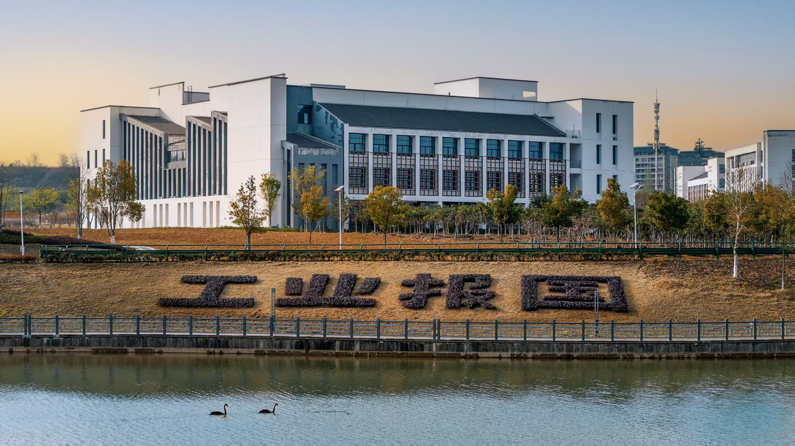

<h1 align="center" style="font-size:40px;">关于</h1>

此仓库存放合肥工业大学宣城校区（HFUT-XC）计算机科学与技术（CS）大一到大四的学习资料

<h1 align="center" style="font-size:30px;">目录</h1>

<h2 align="center">大一</h2>

| 课程名称           | 包含内容                                       |
| ------------------ | ---------------------------------------------- |
| 高等数学           | 教材，PPT，作业习题，历年真题                  |
| 线性代数           | 教材，PPT，作业习题，历年真题，练习题          |
| 数据结构           | 教材，PPT，课后习题答案，真题，实验，课设      |
| Java               | 实验，课后习题（有些资料因为体积原因无法上传） |
| 电路与电子技术基础 | 教材，PPT，实验                                |
| 大学物理           | 教材，PPT，作业习题以及解答，历年真题，习题册  |

<h2 align="center">大二</h2>

|      课程名称      |                 包含内容                  |
| :----------------: | :---------------------------------------: |
|       Python       |              PPT，实验，课设              |
|    程序设计艺术    |       教材，PPT，实验，小组汇报题目       |
|     机器人技术     |              PPT，作业，实验              |
|      离散数学      |         PPT，习题讲解，报告，试卷         |
|      数字逻辑      |          PPT，实验，作业习题解答          |
| 马克思主义基本原理 |           教材（2023版），报告            |
|      计算方法      |         PPT，实验，复习笔记，课本         |
|  概率论与数理统计  |     PPT，教材，历年真题，习题册&解答      |
|        汇编        | PPT，教材，实验，复习资料，真题，习题答案 |
|    大学物理实验    |         试卷，实验报告，复习提纲          |
|   嵌入式系统原理   |      PPT，试卷，课设，实验，考试资料      |
|    EDA实训学习     |         成品，辅助学习资料，报告          |
|      编译原理      |      PPT，真题，复习资料，实验，课设      |
|      机器学习      |        PPT，大作业，学习资料，作业        |
|   计算机组成原理   |         PPT，真题，复习资料，实验         |

