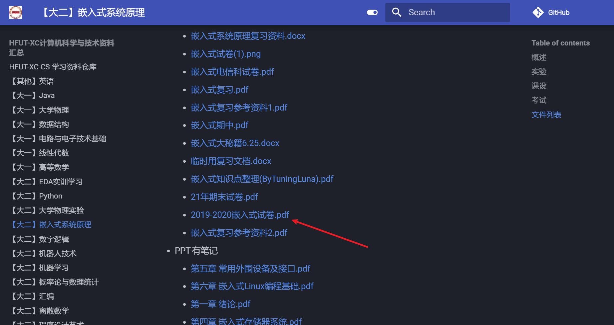
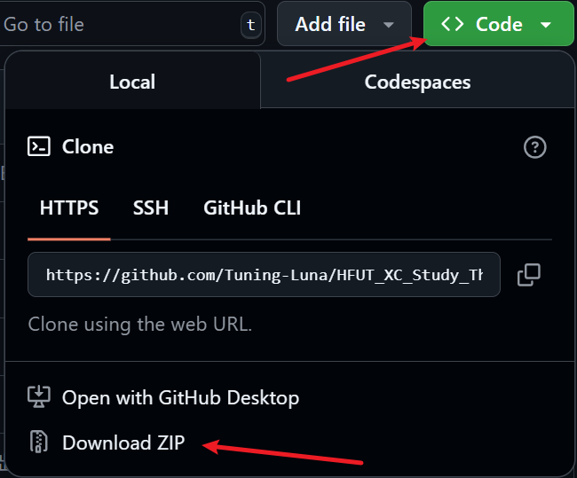
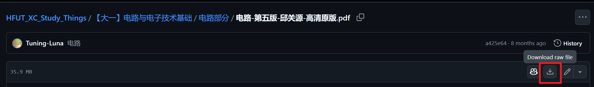

# HFUT-XC CS 学习资料仓库

# 写在前面

本仓库计划存放本人合肥工业大学宣城校区（HFUT-XC）计算机科学与技术（CS）大一到大四的学习资料

有问题欢迎提`Issues`

如果本仓库对你有用，请给个 Star⭐

# 食用方法

## 在线网站

这是资料的在线网站地址：https://tuning-luna.github.io/HFUT_XC_Study_Things/

[在线网站](https://tuning-luna.github.io/HFUT_XC_Study_Things/)和[本仓库](https://github.com/Tuning-Luna/HFUT_XC_Study_Things)的资料**完全同步**，也可以使用网站找到想要的资料可以直接下载



## 全部下载

注：截止 2025.8.7，仓库总大小为 **7.33 GB** ，其中资料约占 **3.92 GB**，确保有足够的内存下载

点击 Code -> Download ZIP 进行全部下载



或者克隆整个仓库：

确保电脑上有[git](https://git-scm.com/downloads)环境，打开 cmd，运行

```bash
git clone https://github.com/Tuning-Luna/HFUT_XC_Study_Things.git
```

克隆整个仓库

还可以使用**Fork**，复制一份作为你的仓库：


## 部分下载

进入需要下载的文件，选择 Download raw file 即可



或者使用插件：

使用[GitZip for GitHub](https://chromewebstore.google.com/detail/gitzip-for-github/ffabmkklhbepgcgfonabamgnfafbdlkn?hl=en-US&utm_source=ext_sidebar) 插件，安装插件并配置好后，文件夹和文件前面会多出复选框，选择需要的勾上并下载即可

# 资料目录

## 大一

| 课程名称           | 包含内容                                       |
| ------------------ | ---------------------------------------------- |
| 高等数学           | 教材，PPT，作业习题，历年真题                  |
| 线性代数           | 教材，PPT，作业习题，历年真题，练习题          |
| 数据结构           | 教材，PPT，课后习题答案，真题，实验，课设      |
| Java               | 实验，课后习题（有些资料因为体积原因无法上传） |
| 电路与电子技术基础 | 教材，PPT，实验                                |
| 大学物理           | 教材，PPT，作业习题以及解答，历年真题，习题册  |
| 程序设计基础       | PPT，实验，作业答案，期末大作业，课设          |

## 大二

|      课程名称      |                 包含内容                  |
| :----------------: | :---------------------------------------: |
|       Python       |              PPT，实验，课设              |
|    程序设计艺术    |       教材，PPT，实验，小组汇报题目       |
|     机器人技术     |              PPT，作业，实验              |
|      离散数学      |         PPT，习题讲解，报告，试卷         |
|      数字逻辑      |          PPT，实验，作业习题解答          |
| 马克思主义基本原理 |           教材（2023 版），报告           |
|      计算方法      |         PPT，实验，复习笔记，课本         |
|  概率论与数理统计  |     PPT，教材，历年真题，习题册&解答      |
|        汇编        | PPT，教材，实验，复习资料，真题，习题答案 |
|    大学物理实验    |         试卷，实验报告，复习提纲          |
|   嵌入式系统原理   |      PPT，试卷，课设，实验，考试资料      |
|    EDA 实训学习    |         成品，辅助学习资料，报告          |
|      编译原理      |      PPT，真题，复习资料，实验，课设      |
|      机器学习      |        PPT，大作业，学习资料，作业        |
|   计算机组成原理   |         PPT，真题，复习资料，实验         |
|      科研训练      |             成品，报告，论文              |

## 公共课

| 课程名称   |                     包含内容                     |
| ---------- | :----------------------------------------------: |
| 英语       |             雨课堂，CET-4/CET-6 真题             |
| 思政教材   | ZG近代史，马原，毛概，思想道德，形式与政策等教材 |
| 题库及答案 | 思想道德与法制，形势与政策，劳动教育等题库+答案  |

<a  href="https://git.io/typing-svg"></a>


