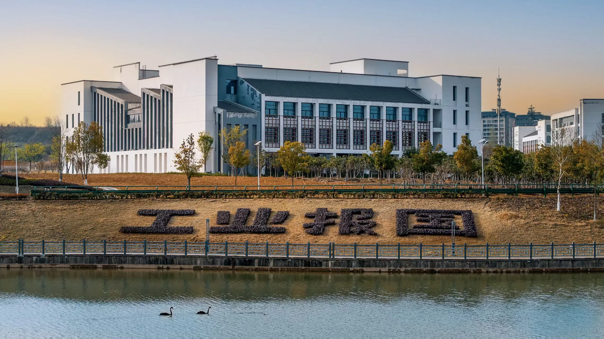

<h1 align="center">HFUT XC Study Things</h1>

<p align="center">
  🎓 合肥工业大学宣城校区 · 计算机科学与技术（CS）本科四年完整学习资料
</p>

<p align="center">
  <a href="https://github.com/Tuning-Luna/HFUT_XC_Study_Things/stargazers"></a>
  <a href="https://github.com/Tuning-Luna/HFUT_XC_Study_Things/commits"></a>
  <a href="LICENSE-ORIGINAL"></a>
  <a href="https://github.com/Tuning-Luna/HFUT_XC_Study_Things"></a>
</p>

<p align="center">
  📚 实验 / 课设 / 作业 / 真题 / PPT / 笔记 / 项目代码<br>
  🗂 大一 → 大四 &nbsp;|&nbsp; 🧑‍💻 持续更新中
</p>


> [!IMPORTANT]
> 本仓库所提供的内容仅作为学习与技术交流参考，不构成任何形式的保证或承诺。作者已尽力确保内容的准确性与完整性，但不对其中可能存在的错误、遗漏或不适用情况承担责任。使用者应自行评估并承担使用相关内容所产生的风险。

# 目录

- [资料目录](#资料目录)
  - [公共课](#公共课)
  - [大一](#大一)
  - [大二](#大二)
  - [大三](#大三)
  - [独立课程项目](#独立课程项目)
- [使用方式](#使用方式)
  - [方式一：在线浏览](#方式一：在线浏览)
  - [方式二：完整克隆](#方式二：完整克隆)
  - [方式三：按需下载](#方式三：按需下载)
- [许可与免责](#许可与免责)
  - [原创内容](#原创内容)
  - [第三方资料](#第三方资料)
- [支持与帮助](#支持与帮助)
- [Images](#images)

# 资料目录

## 公共课

|  课程名称  |                                                               包含内容                                                                |
| :--------: | :-----------------------------------------------------------------------------------------------------------------------------------: |
|    英语    | 教材 PDF（中国文化英语教程、新核心大学英语B版），CET-4 真题（2020-2025 含听力音频），CET-6 真题（2019-2025 含听力音频），CET-6 模拟题 |
|  思政教材  |                     2023 版教材 PDF：中国近现代史纲要，马克思主义基本原理，毛概，习概，思想道德与法治，形势与政策                      |
| 题库及答案 |        形势与政策题库（多版本含答案），思想道德与法治 619 道分章节题库，劳动教育题库，大学生国家安全教育题库，思政题库（HTML）        |

## 大一

|      课程名称      |                                               包含内容                                                |
| :----------------: | :---------------------------------------------------------------------------------------------------: |
|      高等数学      |                  高数上下教材及课后答案解析，高数下课件（两套），高数下期中期末真题                   |
|      线性代数      |                    PPT（新旧两套），十年真题试卷（含答案），练习册（含解答），课本                    |
|      数据结构      |     分章节 PPT（8 章），配套 C++ 源码，课后习题答案，实验（两套含 18+ C++ 练习），考试真题，课设      |
|        Java        |             Java 2 实用教程第 5 版课件与代码，课后习题答案，实验指导，阿里 Java 开发手册              |
| 电路与电子技术基础 | 电路分析 + 模电两部分，PPT（多套），教材（邱关源电路第 5 版 + 模电第 7 版），实验指导书，课后答案解析 |
|      大学物理      |   PPT（新旧三套），章节习题册（含解答），十余年真题试卷，教材（普通物理学 7/8 版），猴博士课堂笔记    |
|    程序设计基础    |    C/C++ 分章 PPT（11 章），实验教程与模板，作业模板，期末大作业，课设（双端队列 deque 完整项目）     |

## 大二

|     课程名称     |                                                                   包含内容                                                                    |
| :--------------: | :-------------------------------------------------------------------------------------------------------------------------------------------: |
|      Python      |                           PPT（校内 + 黑马程序员两套），大量 .py 代码示例（60+），实验指导书，大作业（含报告模板）                            |
|   程序设计艺术   |                      算法竞赛导向：STL/搜索/计算几何讲稿，ICPC 讲义，AHCPC 省赛真题，实验报告（C++ 代码），小组解题汇报                       |
|    机器人技术    |                           分章 PPT（6 章），RoboCup 仿真球队 C++ 代码（uva_base），实验指导书，实验考核 56 题，作业                           |
|     离散数学     |                                         PPT（校内 + 任飞亮慕课 PDF），习题答案，实验任务书，往年试卷                                          |
|     数字逻辑     |                                           按课次 PPT（14 次），课后习题答案，实验（4 个含参考样例）                                           |
|     计算方法     |                              PPT（三套含 2024 最新版），复习笔记（含 LaTeX 源码），实验（C++ 代码 + exe），教材                               |
| 概率论与数理统计 |                                     PPT，教材，习题解答，海量真题（合肥+宣城两校区 2012-2024 共 40+ 份）                                      |
|       汇编       |                         PPT（新旧两套），教材（钱晓捷）+ 习题答案，实验（.asm 代码），复习 PPT，真题，AsmTools 工具包                         |
|   大学物理实验   |                                          复习提纲（25MB），实验报告（两份），往年试卷，部分习题答案                                           |
|  嵌入式系统原理  |                     PPT（新/旧/有笔记三套 22 份），实验指导书 + C 代码，考试试卷（7 份）+ 复习资料，课设（含蜂鸣器代码）                      |
|   EDA 实训学习   |                                  Altium Designer 实训：任务书，AD10 教程，原理图项目，稳压电源手册，实训报告                                  |
|     编译原理     |                  PPT（新旧两套），教材（陈火旺）习题答案，实验（Java 词法分析），真题 + 复习资料，课设（FIRST 集 C++ 实现）                   |
|     机器学习     | PPT（新旧两套），Jupyter Notebook 作业（Python），大作业（电影推荐系统），吴恩达课程，30+ 本 ML/DL 电子书（含西瓜书、花书、李航统计学习方法） |
|  计算机组成原理  |        PPT（新旧两套 21 份），教材（唐朔飞）+ 课后答案，实验 8 次（Verilog/SystemVerilog 40+ 文件），考试真题（6 份含答案），章节提纲         |
|     科研训练     |                 自选项目（AI/大数据方向），成品代码（Jupyter Notebook），报告（Word + LaTeX），答辩 PPT，论文，参考论文与模板                 |

## 大三

|       课程名称       |                                                                                                                                                  包含内容                                                                                                                                                  |
| :------------------: | :--------------------------------------------------------------------------------------------------------------------------------------------------------------------------------------------------------------------------------------------------------------------------------------------------------: |
|    人工智能经济学    |                                                                                                                                       分章 PPT（8 章），案例分析作业                                                                                                                                       |
|    计算机体系结构    |                                                                                        PPT（8 章），WinMIPS64 模拟器 + MIPS 汇编实验（4 个），教材（胡伟武/量化方法等 3 本），章节复习资料，真题（8 份），论文翻译                                                                                         |
|  网络与信息安全技术  |                                                                                       PPT（8 章：密码学、网络安全协议、Web 安全、区块链等），实验（AES/RSA/SM4/ZUC/XSS 五种算法 C++/JS 双语言实现 + 报告），开卷考试                                                                                       |
|     人工智能原理     |                                                                                                     Python/Jupyter 实验（4 个：CNN MNIST、影评情感分析等），期末报告 + 参考文献，课设（RAG 问答系统）                                                                                                      |
|     数字媒体技术     |                                                                                                                  实验（3 个：图像参数调整、效果处理、抠图），期末大作业（视频），调研报告                                                                                                                  |
|     计算机图形学     |                                                                                               PPT（8 讲），作业（OpenSCAD 3D 建模 + VS MFC 光照项目），实验（直线生成算法 + OpenMesh 3D 网格编程），开卷考试                                                                                               |
|       软件测试       |                                                                                     PPT（9 章：测试策略、黑白盒测试、集成/系统测试、质量管理等），作业（文档 + PPT + 手写笔记），实验报告，课堂测试（拍照），闭卷考察                                                                                      |
|       软件工程       |                                                                                                  PPT（13 章含面向对象方法学），期末真题 + 复习笔记（HTML/PDF/MD），课堂测试，团队作业（10 人组队选项目）                                                                                                   |
|     硬件综合设计     |                                                                                                         Verilog CPU 完整设计（流水线、ALU、控制单元等），Vivado/Iverilog 仿真，报告模板，验收 PPT                                                                                                          |
|       操作系统       |                                                                             PPT（按章 + 按课两套 23 份），Linux 内核实验（3 组报告含本人/他人），章节作业，复习资料（含 70 张概念图），课堂测试，课设（C 代码），真题（6 份）                                                                              |
|      计算机网络      |                                                                                      PPT（原版 + 2024 新版两套 15 份），实验（Wireshark 抓包 + 组网），期末真题（10 份），笔记（3 份），考试范围，课设（多方向可选）                                                                                       |
| 计算机应用项目实训课 |                                                                                       无人机项目课程：waypoints 路径文件，无人机系统答辩 PPT，坦克/目标识别图片，实训文档（组装、烧录、ROS 路径规划、图像/语音识别）                                                                                       |
|      数据库系统      | PPT（学习通 2026 版 + openGauss 学生版 + 2022 章节版三套 80+ 份），教材（王珊数据库系统概论第 5 版 + 习题解析），实验（学习通 MySQL 版 14 个 SQL 成品 + 华为云 openGauss 实验 14 个含指导书），期末真题（2015-2024 共 5 份）+ 复习笔记（含问答思考题整理），课设（智能排课系统 SpringBoot + Vue 全栈源码） |

## 独立课程项目

由于部分课程设计和实践项目规模较大，因此独立创建仓库进行维护。
点击下方链接即可访问对应项目：

|                             项目                             |   所属课程   |           技术栈            |                           仓库概况                           |
| :----------------------------------------------------------: | :----------: | :-------------------------: | :----------------------------------------------------------: |
| [题库管理系统](https://github.com/Tuning-Luna/question-bank-management-system) |  数据库系统  |     Vue3+Express+MySQL      | 前后端分离的题库管理系统；内含 init.sql 初始化脚本、数据库设计文档、答辩讲解文档与课设实验报告。 |
| [电影推荐系统](https://github.com/Tuning-Luna/movie-recommender) |   机器学习   |           Python            | 基于用户协同过滤的电影推荐系统；包含数据预处理、模型训练、评分/相似度等多张可视化图与课程报告。 |
| [课堂答题系统](https://github.com/Tuning-Luna/class-quiz-system) |   程序设计   |        C++（控制台）        | 支持试题录入/修改、随机抽题测试、自动判题计分、错题查看；纯控制台程序，无外部依赖。 |
|      [简易链表](https://github.com/Tuning-Luna/my-list)      |   数据结构   |             C++             | 类封装的单链表实现，头结点存储链表长度；提供插入/删除/翻转/排序/查找等 19 个接口。 |
|     [双向队列](https://github.com/Tuning-Luna/my-deque)      | 程序设计基础 |             C++             | 基于数组分段存储的 Deque 容器；支持正/逆向迭代器、随机访问下标、insert/erase 等完整顺序容器接口。 |
| [通讯录管理系统](https://github.com/Tuning-Luna/address-book-manage-system) | 程序课程设计 |        C++（控制台）        | 控制台通讯录管理系统；支持联系人的添加、显示、查找、修改、删除与清空。 |
|     [栈的实现](https://github.com/Tuning-Luna/my-stack)      |   数据结构   |             C++             | 数组与链表两种方式实现栈；提供 push/pop/top/size/empty/clear 等标准操作，并含满栈/空栈提示。 |
| [在线留言板](https://github.com/Tuning-Luna/react-message-board) |  计算机网络  | React 19+Express+SpringBoot | 前后端分离留言板；支持发布留言、搜索、点赞、按时间/热度排序、分页，管理员可回复/删除并邮件通知。 |

> [!TIP]
>
> 如果本仓库对你有用，请点个 **Star** ⭐ 支持一下！

<a  href="https://git.io/typing-svg"></a>

# 使用方式

## 方式一：在线浏览

无需下载，直接访问在线网站查看全部资料：

[**https://tuning-luna.github.io/HFUT_XC_Study_Things**](https://tuning-luna.github.io/HFUT_XC_Study_Things)

仓库与网站内容**完全同步**，在线找到所需文件后直接下载即可。

## 方式二：完整克隆

需要下载全部资料到本地时使用。

**前置条件**：确保电脑已安装 [Git](https://git-scm.com/downloads)

```bash
git clone https://github.com/Tuning-Luna/HFUT_XC_Study_Things.git
```

> [!NOTE]
> 仓库体积较大，`git clone` 完整下载会比较慢，通常推荐使用下方的方式三按需下载。

## 方式三：按需下载

如果你只需要部分文件，推荐使用以下工具：

### GitZip 插件（Chrome / Edge）

1. 安装 [GitZip for GitHub](https://chromewebstore.google.com/detail/gitzip-for-github/ffabmkklhbepgcgfonabamgnfafbdlkn)
2. 安装后打开本仓库 GitHub 页面，文件/文件夹前会出现复选框
3. 勾选你需要的文件，点击下载按钮即可

### 其他替代方案

- **DownGit**：访问 [https://minhaskamal.github.io/DownGit](https://minhaskamal.github.io/DownGit)，粘贴仓库中某个文件夹的链接即可单独下载
- **GitHub RAW 直链**：单个小文件可直接点击 `Raw` 按钮保存

# 许可与免责

### 原创内容

包括但不限于：**作业答案、实验报告、课程设计、笔记、项目代码、复习资料、真题解答**等由 Tuning-Luna 原创整理的内容。

基于 [CC BY-NC-SA 4.0](LICENSE-ORIGINAL) （署名—非商业性使用—相同方式共享）协议开源：

- ✅ **允许**：自由使用、转载、分发、修改
- ✅ **要求**：**署名**原作者（Tuning-Luna），**以相同协议**分享衍生作品
- ❌ **禁止**：用于商业目的，包括直接销售或以盈利为主要目的的使用

### 第三方资料

包括但不限于：**教材、PPT、试卷原题、第三方引用内容，笔记，复习大纲**等。

这些资料的版权归属原作者、出版社及相关的学长学姐，**不附带任何开源协议**，仅供学习与研究用途，不授予任何复制、传播、修改或再分发权利。

---

> [!CAUTION]
> 若内容涉及侵权（如引用来源未标注等），请通过 Issue 告知，我将及时处理。

# 支持与帮助

对于本仓库学习资料有疑问的，可以通过在本仓库提 [issue](https://github.com/Tuning-Luna/HFUT_XC_Study_Things/issues/new) 联系我，看到了就会回复

如果你想整理**自己专业的课程资料仓库**，但不知如何下手（仓库结构、资料整理、README 编写、GitHub 使用等），也欢迎在 GitHub 上联系我，很乐意提供帮助 ❤️

# Images

<p align="center">
  
  
</p>

<p align="center">
  
  
</p>
