## 1.1数据库系统概述

### 数据

数据的含义称为数据的语义，数据与其语义是不可分的。


### 数据库

一组相互有关联的数据集合

特点：

- 有一定的数据模型组织，描述和存储
- 可以为各种用户共享
- 冗余度小
- 独立性高
- 易扩展

### 数据库管理系统

科学地组织和存储数据，高效地获取和维护数据

功能：

- 提供数据库定义语言（DDL）
- 数据组织，存储和管理
- 数据库操纵功能
- 数据库的事务管理和运行管理
- 数据库的建立和维护功能


### 数据库系统

等价于 数据库


特点：

- 物理独立性：用户的应用程序与数据库中的数据的物理存储相互独立。
- 逻辑独立性：用户的应用程序与数据库的逻辑结构相互独立。


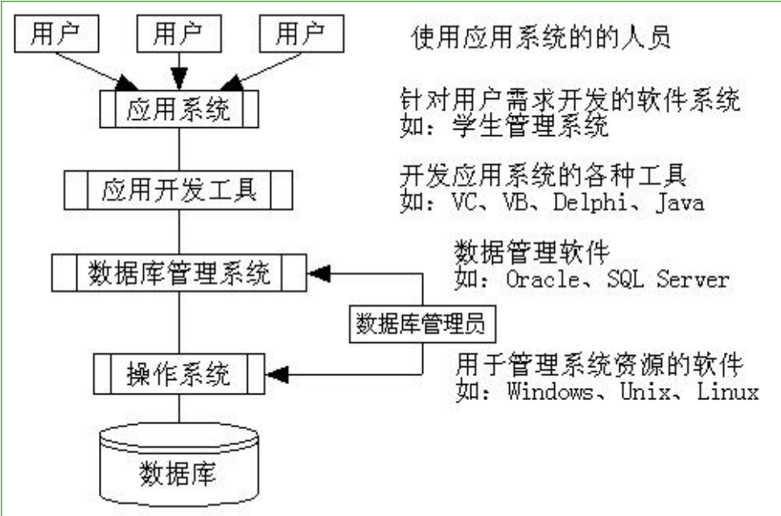


## 1.2数据模型

- **概念模型**（信息模型）：按用户观点对数据和信息建模
- 数据模型（**逻辑模型**：（按计算机观点）和**物理模型**（按系统磁盘观点））

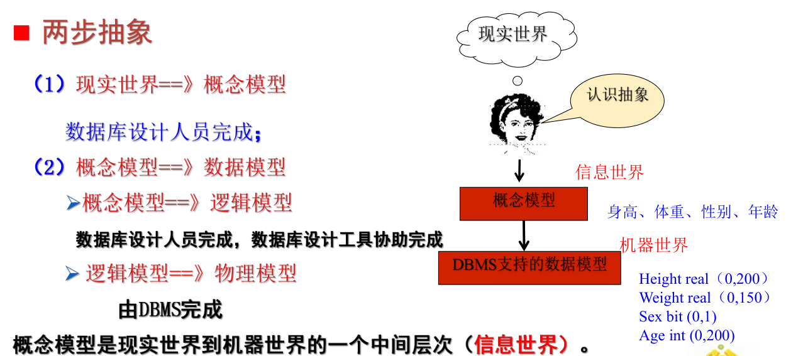


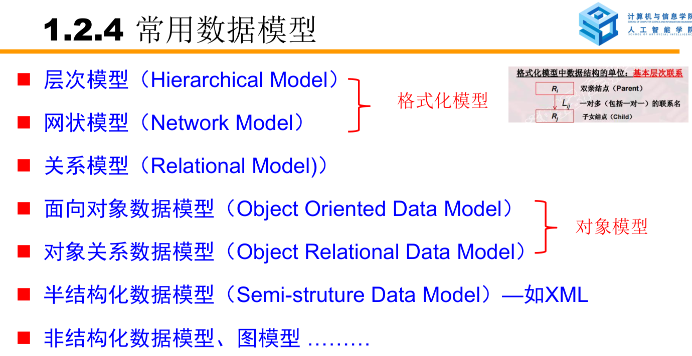


- 层次模型：清晰，效率高。不支持多对多，查询子必须先查询父

- 网状模型：可表示多种复杂关系，良好的性能。结构复杂，DDL/DML复杂。

- 关系模型：结构简单直观（表格），对用户透明。效率不如非关系数据库

  


### 数据模型三要素

- 数据结构：静态结构。描述“数据长什么样、怎么组织”
- 数据操作：动态特征。描述“数据能做什么”
- 数据的约束条件：描述“数据必须满足什么规则”

## 1.3数据库系统的结构

### 模式

- DDL定义数据的逻辑结构，以某种数据模型为基础
- 数据之间的联系
- 数据有关的安全性，完整性要求

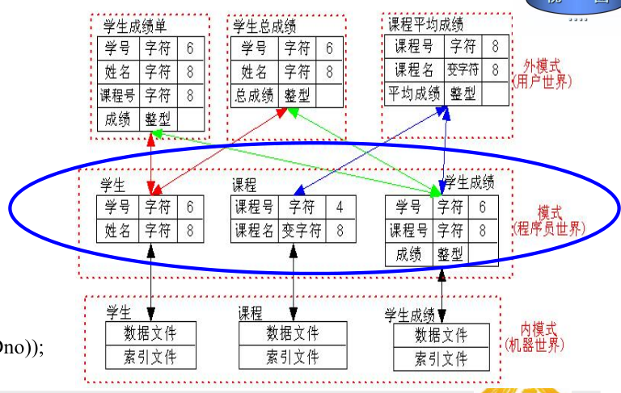


### 外模式

also：子模式/用户模式。

面向“用户”的数据视图，是数据库的局部逻辑结构。

外模式是模式的子集。**一个数据库可以有多个外模式**

每个用户只能看到对应的外模式中的数据


### 内模式

是对物理结构和存储方式的描述。数据在物理存储上的具体实现方式（B+树，哈希，链表）。

**一个数据库只有一个内模式**


### 外模式 / 模式映像

**对每一个外模式，有一个外模式/模式映像**

当模式改变时，DBA对外模式/模式映像作相应改变，使外模式保持不变

应用程序是依据外模式编写的，应用程序不必修改，保证了数据与程序的逻辑独立性，简称数据的**逻辑独立性**


### 模式／内模式映像

**模式/内模式映像是唯一的**

当数据库的存储结构改变了，DBA修改模式/内模式映像，使模式保持不变；

模式不变，则应用程序不变，保证了数据与程序的物理独立性，简称数据的**物理独立性**


### 意义

- 保证稳定性
- 减少应用程序维护

### Summery

- 数据库系统采用三级模式结构，包括外模式、概念模式和内模式。
-  概念模式是数据库的全局逻辑结构，是整个数据库的统一描述。
-  外模式是面向不同用户的局部数据视图，一个数据库可以有多个外模式，它们是概念模式的子集，用于满足不同用户的数据需求。
-  内模式描述数据的物理存储结构，一个数据库通常只有一个内模式。
- 数据独立性是通过两级映像机制实现的：
-  外模式与概念模式之间的映像保证逻辑独立性，
-  概念模式与内模式之间的映像保证物理独立性。


### 数据库系统组成

- 数据库
- 数据库管理系统（及其开发工具）
- 应用系统
- 数据库管理员


## 2.关系数据库


### 笛卡尔积

| 概念                          | 定义             | 本质理解             | 例子                      |
| ----------------------------- | ---------------- | -------------------- | ------------------------- |
| 笛卡尔积（Cartesian Product） | D1 × D2 × … × Dn | 所有可能组合         | 学号 × 姓名 = 全排列      |
| 关系（Relation）              | 笛卡尔积的子集   | **有意义的数据集合** | Student表中的真实记录     |
| 子集（Subset）                | A ⊆ B            | 从集合中选一部分     | 查询结果是原表子集        |
| 关系模式                      | R(D1, D2, …, Dn) | 表结构定义           | Student(SNo, SName, SAge) |
| 关系的度（Degree）            | 属性个数 n       | 列数                 | 3列 = degree 3            |


### 码

| 概念   | 作用                   | 特点       |
| ------ | ---------------------- | ---------- |
| 候选码 | 唯一标识元组           | 可以有多个 |
| 主码   | 选定的唯一标识         | 只能一个   |
| 全码   | 整个属性组才唯一       | 极端情况   |
| 外码   | 引用别的表主码(stu_id) | 建立关系   |

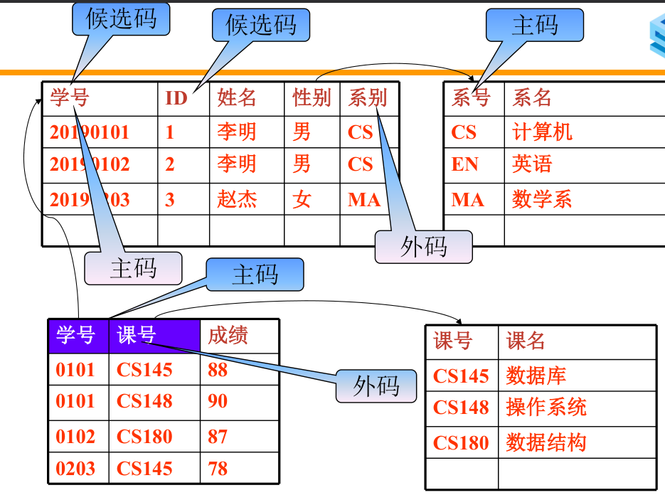

### 属性

| 概念                            | 定义                   | 本质理解             | 举例（Student表）      |
| ------------------------------- | ---------------------- | -------------------- | ---------------------- |
| 主属性（Prime Attribute）       | 属于**候选码中的属性** | “参与唯一标识”的字段 | 学号（SNo）            |
| 非主属性（Non-Prime Attribute） | 不属于任何候选码       | “普通描述字段”       | 姓名、年龄、性别、班级 |


### 关系

| 类型                                    | 定义                    | 是否真实存储   | 是否持久存在  | 举例                  | 本质         |
| --------------------------------------- | ----------------------- | -------------- | ------------- | --------------------- | ------------ |
| 基本关系（Basic Relation / Base Table） | 实际存在的表            | ✔ 是           | ✔ 是          | Student表、Course表   | 真正存数据   |
| 查询表（Query Result Table）            | 查询产生的临时结果      | ❌ 否           | ❌ 否          | SELECT结果            | 临时视图结果 |
| 视图表（View）                          | 由基本表/视图导出的虚表 | ❌ 不直接存数据 | ✔（定义存在） | CREATE VIEW v_student | “虚拟表”     |

**视图（VIEW）不存数据，只是存了一条SQL查询语句的“虚拟表”，查它等于实时执行这条SQL。**由基本表或其他视图表导出的表，是虚表，不对应实际存储的数据

性质：

| 性质                   | 含义                       | 人话理解              |
| ---------------------- | -------------------------- | --------------------- |
| ① 列是同质的           | 同一列必须同类型           | 一列不能混字符串+数字 |
| ② 不同列可同域         | 不同列可以来自同一数据范围 | 学号和班级都可用 int  |
| ③ 列无序               | 列顺序不影响关系           | 调换列不改变表        |
| ④ 元组唯一（靠候选码） | 不能有重复行               | 主键保证唯一          |
| ⑤ 行无序               | 行顺序无意义               | 数据库不关心排序      |
| ⑥ 分量必须原子性       | 每个值不能再分             | 不允许“张三,18”放一格 |

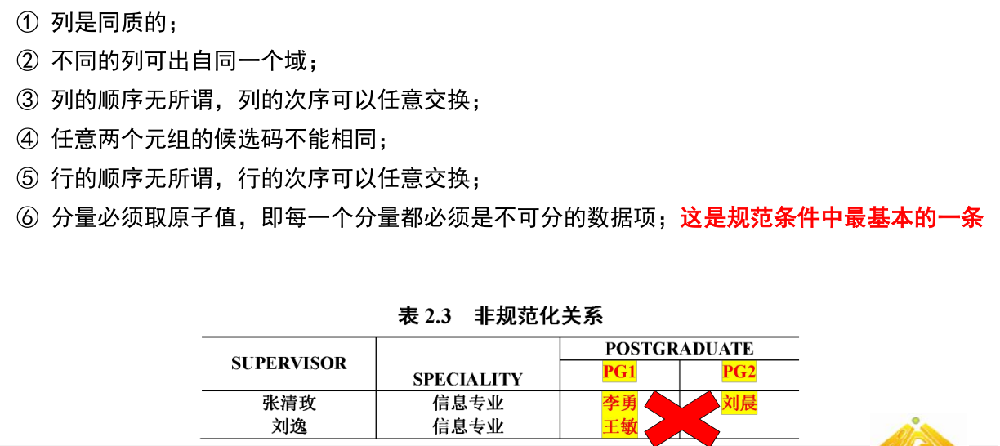

### 关系VS关系模式

| 对比     | 关系模式       | 关系             |
| -------- | -------------- | ---------------- |
| 本质     | 结构（Schema） | 数据（Instance） |
| 状态     | 静态           | 动态             |
| 是否变化 | 不变           | 随时间变化       |
| 类比     | 类（class）    | 对象（object）   |

所有**关系**的集合构成一个关系数据库。


### 关系模式形式化定义

R(U, D, DOM, F) =

- 表名 R
- 列集合 U
- 每列取值范围 D
- 每列数据类型 DOM
- 列之间的依赖关系 F

| 理论 | SQL                    |
| ---- | ---------------------- |
| R    | Student                |
| U    | Sno, Sname, Ssex, Sage |
| DOM  | CHAR(8), INT           |
| D    | 取值范围（隐含）       |
| F    | 主键 / 外键 / 函数依赖 |


### 关系操作

一个关系(relation)就是一个Table

- 查询：选择、投影、连接、除、并、交、差
- 数据更新：插入、删除、修改
- **选择、投影、并、差、笛卡尔积**是5种基本操作


| 关系代数   | SQL            |
| ---------- | -------------- |
| σ 选择     | SELECT * WHERE |
| π 投影     | SELECT 某些列  |
| × 笛卡尔积 | CROSS JOIN     |
| ∪ 并       | UNION          |
| − 差       | EXCEPT / MINUS |
| ⨝ 连接     | JOIN           |
| ∩ 交       | INTERSECT      |

除法：**找“满足所有条件”的那部分数据（全覆盖问题）**

找“对右表每一行都满足”的左表记录

e.g.：

选课表 SC：

| student | course |
| ------- | ------ |
| A       | DB     |
| A       | OS     |
| B       | DB     |
| C       | DB     |
| C       | OS     |
| C       | CN     |


目标表 R：

| course |
| ------ |
| DB     |
| OS     |


找出 **选了 R 中所有课程的学生**

SC / R 答案：

| student |
| ------- |
| A       |
| C       |

解释：

- A → DB + OS ✔
- B → 只有 DB ❌
- C → DB + OS ✔


### 关系的完整性

| 类型           | 核心作用                   | 约束对象            | 规则                           | 是否必须 | 举例                             | 违反后果           |
| -------------- | -------------------------- | ------------------- | ------------------------------ | -------- | -------------------------------- | ------------------ |
| 实体完整性     | 保证“每一行是可识别的实体” | 主键（Primary Key） | ① 不为空（NOT NULL）② 不重复   | ⭐必须    | id = NULL ❌ / id重复 ❌           | 插入/更新直接失败  |
| 参照完整性     | 保证“表与表之间关系正确”   | 外键（Foreign Key） | 外键值必须存在于被参照表主键中 | ⭐必须    | Score.sid=3，但Student没有id=3 ❌ | 插入/删除/更新报错 |
| 用户定义完整性 | 保证“业务逻辑正确”         | 任意字段            | 自定义规则（CHECK / 业务约束） | ❗可选    | age ≥ 0、score 0~100             | 不符合则拒绝       |

实体完整性保证主键唯一且非空；参照完整性保证外键必须存在；用户定义完整性保证业务规则正确。


## 3.关系数据库标准语言SQL


### 数据库的定义

集数据定义语言（DDL），数据操纵语言（DML），数据控制语言（DCL）功能于一体。
DDL语句引导词：Create(建立), Alter (修改), Drop(撤消)

模式的定义和删除，包括定义Database, Table, View, Index,完整性约束 条件等，也包括定义对象(RowType行对象,Type列对象)
DML语句引导词：Insert , Delete, Update, Select

### 模式的定义与删除

定义模式实际上定义了一个命名空间；

`CREATE SCHEMA <模式名> AUTHORIZATION <用户名> [<表定义子句>|<视图定义子句>|<授权定义子句>]`

删除就用DROP


### 基本表的定义、删除与修改

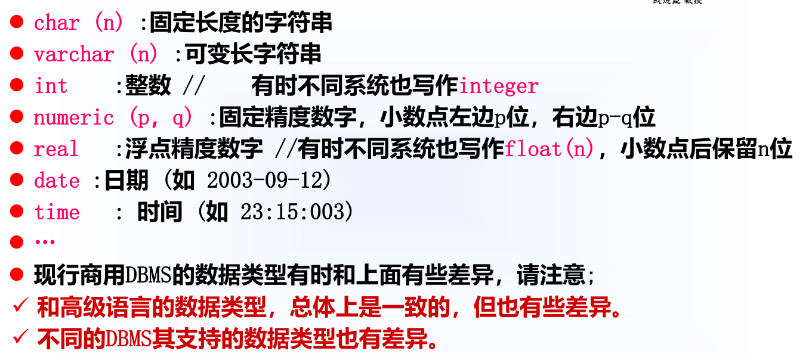

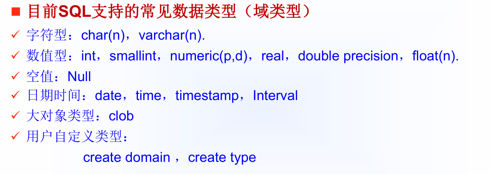


### 索引的建立和删除

CREATE [UNIQUE] INDEX 索引名 ON 表名 (列名1, 列名2, ...);

- 对于已含重复值的属性列不能建UNIQUE索引
- 对某个列建立UNIQUE索引后，插入新记录时DBMS会自动检查新记录在该列上是否取了重复值。这相当于增加了一个UNIQUE约束


**聚簇索引**的用途：对于某些类型的查询，可以提高查询效率

聚簇索引的适用范围

1. 很少对基表进行增删操作
2. 很少对其中的变长列进行修改操作

聚簇索引的不适用情形

1. 表记录太少
2. 经常插入、删除、修改的表
3. 数据分布平均的表字段


### 数据查询

单表查询：

```sql
SELECT [ALL | DISTINCT] 
       { * | 列名1 [AS 别名1], 列名2 [AS 别名2], ... }
  FROM 表名 [AS 表别名]
 [WHERE 条件表达式]
 [GROUP BY 分组列1, 分组列2, ...]
 [HAVING 分组后的筛选条件]
 [ORDER BY 排序列1 [ASC | DESC], 排序列2 [ASC | DESC], ...]
 [LIMIT {行数 | OFFSET 起始位置, 行数}]
```


| 子句         | 必选/可选 | 参数/选项                                                    | 作用                                                  |
| :----------- | :-------- | :----------------------------------------------------------- | :---------------------------------------------------- |
| **SELECT**   | ✅ 必选    | `ALL`（默认，保留重复行） `DISTINCT`（去重） `*` 全部列 或指定列名 + `AS` 别名 | 指定要查询哪些列                                      |
| **FROM**     | ✅ 必选    | 表名，可加 `AS 别名`                                         | 指定数据来源表                                        |
| **WHERE**    | ❌ 可选    | 比较运算（`=`、`>`、`<`、`<>`） 逻辑运算（`AND`、`OR`、`NOT`） `IN`、`BETWEEN`、`LIKE`、`IS NULL` | 对**原始行**进行筛选（逐行过滤）                      |
| **GROUP BY** | ❌ 可选    | 一个或多个列名                                               | 对数据分组，通常配合聚合函数（`COUNT`、`SUM` 等）使用 |
| **HAVING**   | ❌ 可选    | 条件表达式（可使用聚合函数）                                 | 对**分组后**的结果进行筛选（`WHERE` 做不到）          |
| **ORDER BY** | ❌ 可选    | 列名 + `ASC`（升序，默认）或 `DESC`（降序） 支持多列排序     | 对最终结果排序                                        |
| **LIMIT**    | ❌ 可选    | 两种写法： ① `LIMIT N`（前 N 行） ② `LIMIT M, N`（跳过 M 行，取 N 行） （MySQL 风格） | 限制返回的行数                                        |


### 连接查询

等值于非等值连接查询

```sql
-- 等值连接（最常见）
SELECT *
FROM student s
INNER JOIN score c ON s.id = c.student_id;  -- 这里用的是 =
```


```sql
-- 非等值连接：查每个员工工资在哪个等级区间
SELECT 
    e.emp_name,
    e.salary,
    g.grade_level
FROM employee e
INNER JOIN salary_grade g 
    ON e.salary BETWEEN g.low_salary AND g.high_salary;  -- 注意：不是 =，是 BETWEEN
```


**自身连接**：同一个表，取两个不同的别名进行查询


**外连接：**

外连接与普通连接的区别：

- 普通连接操作只输出满足连接条件的元组

- 外连接操作以指定表为连接主体，将主体表中不满足连接条件的元组一并输出

  左外连接

  列出左边关系中所有的元组

  右外连接

  列出右边关系中所有的元组


**多表连接： ** 两个以上的表进行连接


**ON 管"怎么拼"，WHERE 管"留哪些"。**


### 嵌套查询

内层查询的结果供外层使用：


查询和张三同岁的全部学生：

```sql
-- 嵌套查询写法
SELECT * FROM students
WHERE age = (
    SELECT age FROM students WHERE name = '张三'
);
```


找出所有“非 CS 系”的学生中，年龄小于“CS 系里最大年龄”的那些人的姓名和年龄：

````sql
SELECT Sname, Sage               -- ① 最终要显示：姓名 和 年龄
FROM Student                     -- ② 从学生表中查
WHERE Sage <                     -- ③ 年龄小于（后面的值）
    (SELECT MAX(Sage)            -- ④ 子查询：计算 CS 系的最大年龄
     FROM Student
     WHERE Sdept = 'CS')         -- ⑤ 只针对 CS 系的学生
AND Sdept <> 'CS';               -- ⑥ 并且自己的系别不是 CS
````


查询其他系中比信息系所有学生年龄都小的学生姓名及年龄：

方法一：用ALL谓词：

```sql
SELECT Sname，Sage FROM Student
WHERE Sage < ALL (SELECT Sage FROM Student WHERE Sdept= ' IS ')
AND Sdept <> ' IS ’;
```

方法二：用聚集函数;

```sql
SELECT Sname，Sage FROM Student
WHERE Sage < (SELECT MIN(Sage) FROM Student WHERE Sdept= ' IS ')
AND Sdept <>' IS ’;
```


### 集合查询

- 并操作UNION
- 交操作INTERSECT
- 差操作EXCEPT

对**两个或多个 `SELECT` 语句的查询结果**进行并、交、差等集合运算。参与运算的每个查询结果集必须满足以下**两个前提条件**：

- **列数相同**：每个 `SELECT` 语句返回的列数必须一样多。
- **数据类型兼容**：对应位置上的列的数据类型必须相同或可隐式转换。


UNION（并集）：选C001 **或** C002的学生

```sql
SELECT student_id FROM enrolls WHERE course_id = 'C001'
UNION
SELECT student_id FROM enrolls WHERE course_id = 'C002';
```


INTERSECT（交集）：**同时**选了C001 **和** C002的学生

```sql
SELECT student_id FROM enrolls WHERE course_id = 'C001'
INTERSECT
SELECT student_id FROM enrolls WHERE course_id = 'C002';
```


XCEPT / MINUS（差集）：选了C001 **但没选** C002的学生

```sql
SELECT student_id FROM enrolls WHERE course_id = 'C001'
MINUS
SELECT student_id FROM enrolls WHERE course_id = 'C002';
```


### 插入数据

 ```sql
 INSERT INTO 表名 (列1, 列2, 列3, ...) 
 VALUES (值1, 值2, 值3, ...);
 ```


也可以先通过select 计算出子结果，再插入：

````sql
-- ❌ 直接插入：只能写死值
INSERT INTO salary_report (employee_id, bonus) 
VALUES (1, 5000);  -- 只能一条条写

-- ✅ SELECT 插入：自动计算
INSERT INTO salary_report (employee_id, bonus)
SELECT 
    employee_id,
    base_salary * 0.3 + performance_score * 1000  -- 动态计算
FROM employees
WHERE department = 'Sales';
````


### 修改数据

```sql
UPDATE 表名
SET 列1 = 新值1, 列2 = 新值2, ...
[WHERE 条件]
[ORDER BY ...]
[LIMIT ...];
```

不加 WHERE 会更新**所有行**


### 删除数据

```sql
DELETE FROM <表名> [WHERE <条件>]
```

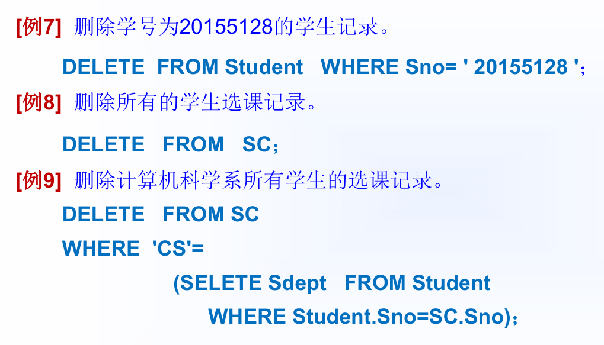


### 视图

**视图是一个虚拟表**，它是基于 SQL 查询结果生成的，不存储实际数据，只保存查询定义

基于视图的操作：

查询、删除、受限更新、定义基于该视图的新视图

```sql
CREATE VIEW 视图名 AS
SELECT 列1, 列2, ...
FROM 表名
[WHERE 条件]
[WITH CHECK OPTION];  -- 限制更新
```


建立信息系选修了1号课程且成绩在90分以上的学生视图：

```sql
CREATE VIEW IS_S2 AS
SELECT Sno，Sname，Grade
FROM IS_S1
WHERE Grade>=90;
```


查询视图和查询普通表的语法**没有任何区别**


更新视图和更新普通表的语法**没有任何区别**


作用：

1. 视图能够简化用户的操作；
2. 视图使用户能以多种角度看待同一数据；
3. 视图对重构数据库提供了一定程度的逻辑独立性；
由于对视图的更新是有条件的，因此应用程序中修改数据的语句可能仍会因基本表结构
的改变而改变。
4. 视图能够对机密数据提供安全保护；
对不同用户定义不同视图，使每个用户只能看到他有权看到的数据
通过WITH CHECK OPTION对关键数据定义操作时间限制
5. 适当的利用视图可以更清晰的表达查询


## 4.数据安全性

不安全因素：

1. 非授权用户对数据库的恶意存取和破坏
2. 数据库中重要或敏感数据被泄露
3. 安全环境的脆弱性


安全系列：

- **D 级（最低保护）**：无任何安全防护。任何用户都可无限制访问所有资源。典型代表：早期的 DOS 系统。
- **C1 级（自主安全保护）**：提供**自主访问控制（DAC）**，用户可以设置自己文件的权限（如“只读”、“读写”），但用户对自身的权限控制能力很弱。
- **C2 级（受控的访问保护）**：在 C1 基础上增加**审计和资源隔离**，且用户权限粒度更细。这是商用操作系统的主流安全基线。典型代表：Windows 2000。
- **B1 级（标记安全保护）**：引入**强制访问控制（MAC）**和**安全标签**（如“绝密”、“机密”、“秘密”）。系统不再完全听命于文件所有者，而是听命于标签规则。典型代表：经过加固的 SELinux 系统。
- **B2 级（结构化保护）**：要求系统架构清晰、分层，并进行**形式化建模**。必须确保系统内不存在隐蔽信道（如通过CPU占用率泄密）。设计和实现必须经过严格评审。
- **B3 级（安全域）**：进一步强化，要求安全功能必须**不可绕过**，且系统具备**极强的抗渗透能力**。管理员和普通操作员权限严格分离。
- **A1 级（验证设计）**：最高级别。在 B3 的基础上，要求使用**形式化数学方法**来证明安全策略的正确性，且整个生命周期（设计、实现、维护）都必须经过形式化验证。


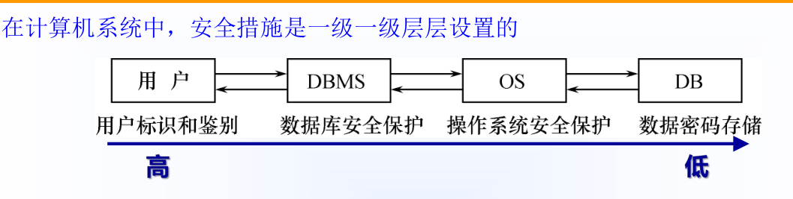


### 数据库安全控制

#### 用户标志与识别：

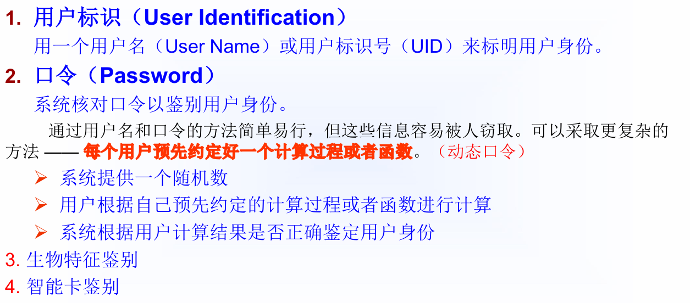


#### 存取控制：

数据库安全性的重点在于**DBMS的存取控制机制**，其根本目标是**确保只授权给有资格的用户**，同时**阻止所有未授权人员接近数据**。


存取控制机制的两大组成部分：

| 组成部分           | 说明                                                         |
| :----------------- | :----------------------------------------------------------- |
| **① 定义用户权限** | 用户对某一数据对象的操作权力称为**权限**。DBMS通过专门的语言定义这些权限，并将其作为**安全规则/授权规则**存放在**数据字典**中。 |
| **② 合法权限检查** | 当用户发出存取数据库的操作请求时，DBMS会查找数据字典中的授权规则，进行权限校验，决定是否放行该操作。 |

> **两者合在一起，共同构成了DBMS的安全子系统**


两种常用的存取控制方法：

| 方法                    | 核心特点                                                     | 实现方式                                                 |
| :---------------------- | :----------------------------------------------------------- | :------------------------------------------------------- |
| **自主存取控制（DAC）** | 灵活。同一用户对不同对象权限不同，不同用户对同一对象权限也不同，且**用户可将自己的权限转授给其他用户**。 | 通过 SQL 的 `GRANT`（授权）和 `REVOKE`（回收）语句实现。 |
| **强制存取控制（MAC）** | 严格（B1级及以上）。**数据对象被标记密级**，**用户被授予许可证级别**，只有持有合法许可证的用户才能存取对应密级的数据。 | 系统强制裁决，用户无权转授或更改。                       |


#### 自主存取控制方法

这是一个**“定义 → 存储 → 检查 → 执行”**的闭环过程：

| 步骤           | 角色                   | 动作                                                         |
| :------------- | :--------------------- | :----------------------------------------------------------- |
| **① 定义规则** | DBA（数据库管理员）    | 使用 **SQL-DCL**（数据控制语言）定义安全性控制规则（即授权规则）。 |
| **② 存储规则** | DBMS                   | 将定义好的规则存入**数据字典**（系统内部的安全目录）。       |
| **③ 检查权限** | DBMS（安全性控制程序） | 当用户发出访问请求时，**自动**依据数据字典中的规则进行合法权限检查。 |
| **④ 执行访问** | DBMS（查询执行程序）   | 检查**通过**则允许访问并返回结果，**不通过**则拒绝请求。     |

> 整个过程对用户透明，由DBMS自动完成。


将权限划分为**3个级别**，且**高级别权限自动包含低级别权限**：

| 级别              | 权限名称           | 具体操作                                        | 说明                                            |
| :---------------- | :----------------- | :---------------------------------------------- | :---------------------------------------------- |
| **级别1（最低）** | **读（Select）**   | 读取数据库、表、记录、属性列等数据              | 基础查询能力                                    |
| **级别2（中间）** | **修改（Modify）** | INSERT（插入）、UPDATE（更新）、DELETE（删除）  | **自动包含**级别1的读权限（要修改必须先能读到） |
| **级别3（最高）** | **创建（Create）** | CREATE（创建）、ALTER（更新结构）、DROP（删除） | 模式级权限，**自动包含**级别1和级别2的所有权限  |


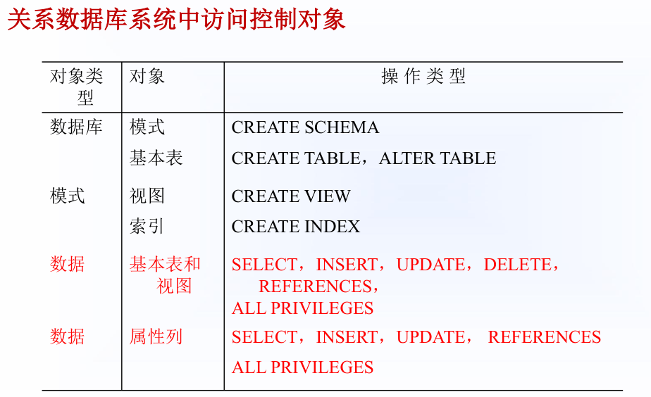


#### 授权与回收

授予权限用GRANT

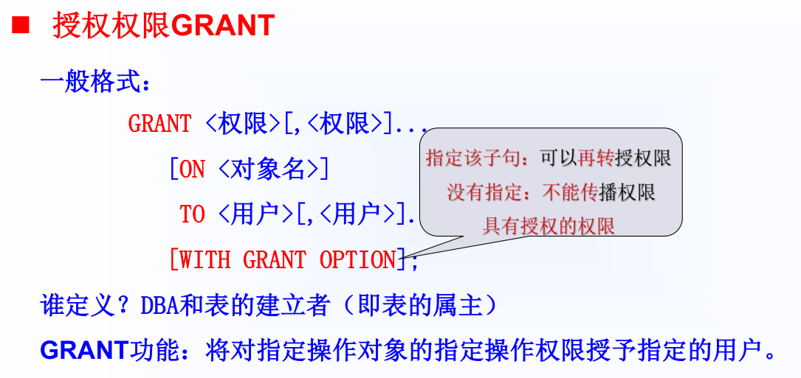

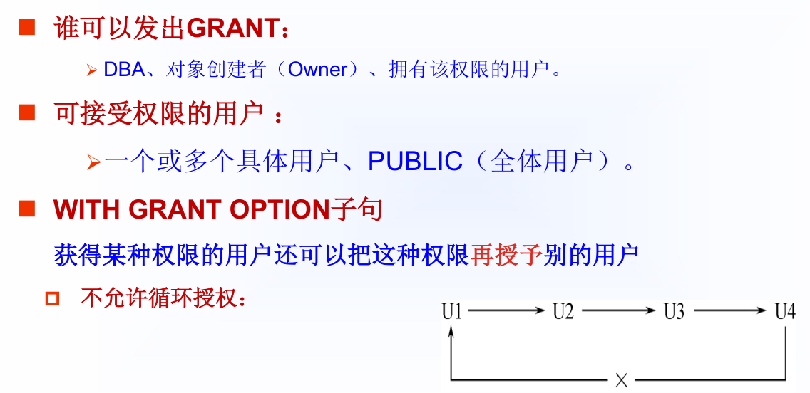


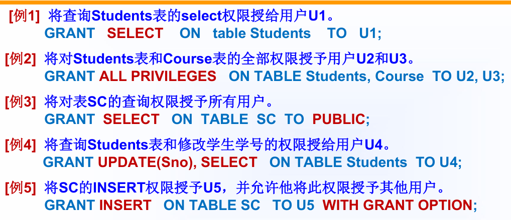

收回权限用 REVOKE

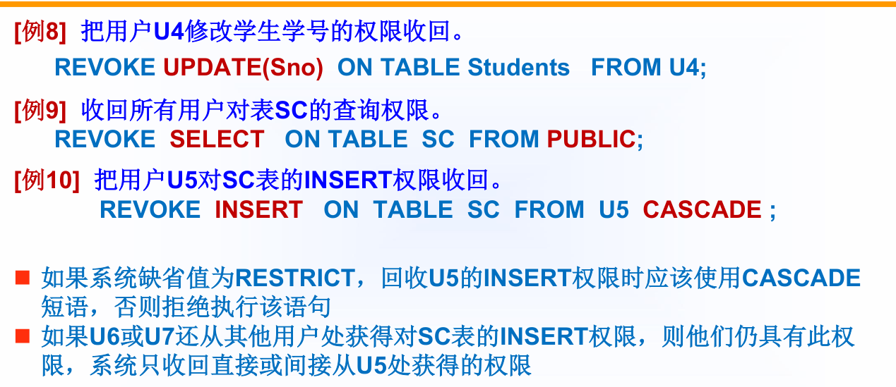


## 5.数据库完整性

指的是数据的**正确性**（年龄不能是 -5）+  **相容性**（身份证号里的日期必须等于出生日期）

- 完整性：阻止**合法用户**通过**合法操作**加入**非法数据**
- 安全性：阻止**非法用户**和**非法操作**加入**正确数据**

完整性检查是围绕约束条件进行的，完整性约束条件是完整性控制机制的核心


### 实体完整性

**主键（Primary Key）的值必须唯一且非空（NOT NULL）**

用PRIMARY KEY定义

**关系模型中的每一个元组（行）都应当是唯一的、可区分的，且不能出现“无名氏”。**


### 参照完整性

**一个表中的外键（Foreign Key）值，要么为空（NULL），要么必须在被引用表的主键中存在**

**“不能凭空引用一个不存在的东西。”**

```sql
-- 先创建被引用的父表（班级表）
CREATE TABLE 班级 (
    班级号 CHAR(6) PRIMARY KEY,
    班级名称 VARCHAR(30)
);

-- 再创建引用子表（学生表），用 FOREIGN KEY 定义外键
CREATE TABLE 学生 (
    学号 CHAR(10) PRIMARY KEY,
    姓名 VARCHAR(20),
    班级号 CHAR(6),  -- 这是一个外键
    FOREIGN KEY (班级号) REFERENCES 班级(班级号)
);
```


### 用户定义完整性

**除了主键非空唯一、外键引用有效之外，其他所有针对具体字段的“合理性”要求，都属于用户定义完整性。**

属性上约束条件：

```sql
CREATE TABLE 员工 (
    员工号 CHAR(10) PRIMARY KEY,
    身份证号 CHAR(18) UNIQUE,  -- 身份证号全国唯一，但不能为空，所以用UNIQUE而非PRIMARY KEY
    邮箱 VARCHAR(50) UNIQUE,     -- 邮箱也不能重复
    Cno CHAR(4) NOT NULL, -- 非空
);
```

通过check检查：

```sql
CREATE TABLE 员工 (
    员工号 CHAR(10) PRIMARY KEY,
    姓名 VARCHAR(20),
    性别 CHAR(2) CHECK (性别 IN ('男', '女')),  -- 只能是男或女
    年龄 INT CHECK (年龄 BETWEEN 18 AND 60),    -- 员工年龄必须在18-60之间
    月薪 DECIMAL(10,2) CHECK (月薪 >= 0)        -- 工资不能为负数
);
```


元组上约束条件的定义：

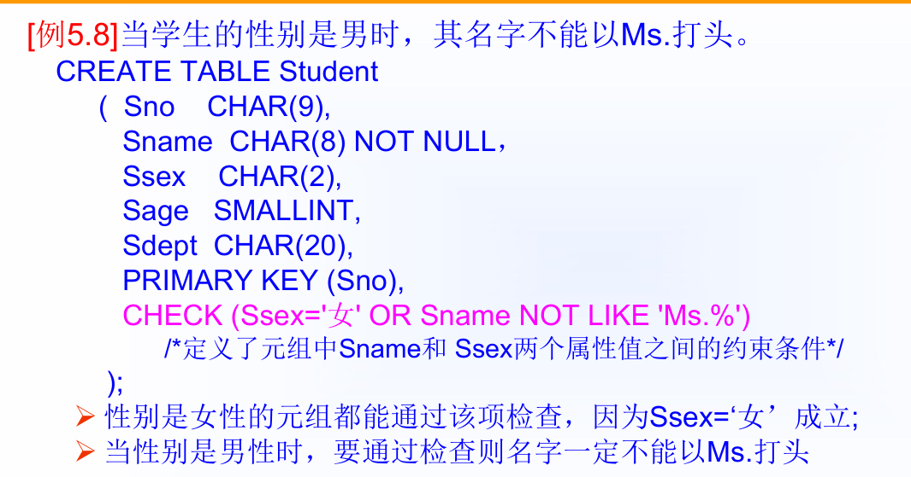


#### 完整性约束命名子句

效果一样，只是可以取名，后面方便删除

```sql
CREATE TABLE student (
    id INT PRIMARY KEY,
    course_id INT,

    CONSTRAINT fk_student_course
        FOREIGN KEY (course_id)
        REFERENCES course(id) -- 定义外键，跟直接写外键没区别
);

-- 删除外键约束，可以用定义好的名字删除
DROP FOREIGN KEY fk_student_course;
```


#### 断言

**断言（Assertion）**是一种数据库级约束**，用于限制**整个数据库**必须满足某个条件，而不仅仅是某一张表或某一列。

````sql
CREATE ASSERTION 断言名
CHECK (条件);

-- 删除断言
DROP ASSERTION 断言名
````


教师工资不得低于3000：

```sql
CREATE ASSERTION salary_check
CHECK (
    NOT EXISTS (
        SELECT *
        FROM Teacher
        WHERE salary < 3000
    )
);
```


#### 触发器

当数据库发生某种操作时，自动执行的一段 SQL 程序

```sql
CREATE TRIGGER 触发器名
触发时机 触发事件
ON 表名
(FOR EACH ROW) -- 有就是行级，没有就是表级
BEGIN
    SQL语句;
END;

-- 删除：
DROP TRIGGER 触发器名
```

| 部分                 | 含义         |
| -------------------- | ------------ |
| CREATE TRIGGER       | 创建触发器   |
| BEFORE/AFTER         | 什么时候触发 |
| INSERT/UPDATE/DELETE | 什么事件     |
| ON                   | 哪张表       |
| BEGIN...END          | 要执行什么   |


| 操作   | OLD                | NEW                |
| ------ | ------------------ | ------------------ |
| INSERT | 无数据（还没插入） | 有数据             |
| UPDATE | 有数据             | 有数据             |
| DELETE | 有数据             | 无数据（已经删除） |


## 6.关系数据理论

### 问题提出

把所有信息（订单、客户、商品、地址）塞进一张巨大的“万能表”里：

| 订单ID | 客户姓名 | 客户电话 | 商品名称 | 商品价格 | 收货地址    |
| :----- | :------- | :------- | :------- | :------- | :---------- |
| 001    | 张三     | 138xxx   | 苹果手机 | 8000     | 北京朝阳区A |
| 001    | 张三     | 138xxx   | 充电器   | 100      | 北京朝阳区A |
| 002    | 李四     | 139xxx   | 苹果手机 | 8000     | 上海浦东B   |

**这么做会带来三大灾难：**

1. **数据冗余（浪费空间）**：张三的电话和地址，每买一个商品就重复写一遍。
2. **更新异常（容易出错）**：如果张三搬家了，你得把这张表里所有“北京朝阳区A”都改成“北京朝阳区B”。万一漏改一条，数据就矛盾了。
3. **插入/删除异常（逻辑丢失）**：如果李四只下了订单但还没买商品（商品名称是空的），这条记录插不进去（因为主键不完整）。或者，如果苹果手机下架了，我删掉“手机”这条记录，连同“8000元”这个价格信息也一起丢失了。


### 规范化

函数依赖：

- 如果属性 Y*Y* 的取值依赖于属性 X*X*，那么在任意时刻，只要 X*X* 的值确定，Y*Y* 的值就**必须**是唯一确定的。
- **记法**：X→Y（X 函数决定 Y，或 Y 函数依赖于 X）。
- “身份证号”确定，则“姓名”必确定，所以：`身份证号 -> 姓名`。

#### 1. 平凡函数依赖 vs 非平凡函数依赖（区别在“右边是否包含在左边”）

- **平凡（Trivial）**：X→Y，且 Y⊆X。

  - 比如：`(学号, 姓名) -> 姓名`。这永远成立，因为左边集合里本来就有“姓名”。这种依赖**没有实际意义**，不提供任何约束价值，设计时通常忽略。

- **非平凡（Nontrivial）**：X→Y，且 Y 不包含 X。

  - 比如：`学号 -> 姓名`。这是真正有意义的业务约束。**我们在数据库设计中，研究的全部都是“非平凡函数依赖”**。

  

#### 2. 完全函数依赖 vs 部分函数依赖（区别在“左边属性的个数”）

**区分 1NF 和 2NF 的数学标尺。**

- **完全函数依赖（Full FD）**：在 X→Y中，如果去掉 X 中的**任何一个**属性，这个依赖就不成立了。必须靠 X 整体才能决定 Y。
  - 对应我上轮讲的“完全依赖”：`(学号, 课程号) -> 成绩`。因为只凭学号不知道成绩，只凭课程号也不知道成绩，必须**两个一起**才能查出分数。
- **部分函数依赖（Partial FD）**：在 X→Y中，存在 X的**真子集**  X，使得X →Y成立。
  - 对应我上轮讲的“部分依赖”：`(学号, 课程号) -> 姓名`。因为不需要课程号，仅凭学号的子集就能决定姓名。

> **对应关系**：**第二范式（2NF）** 的定义就是——**消除非主属性对候选码的“部分函数依赖”**。

#### 3. 传递函数依赖（区别在“是否直接决定”）

**这是区分 2NF 和 3NF 的数学标尺。**

- **定义**：若 X→Y，Y→Z ，且满足：
  1. Y 不属于  X（非平凡）
  2. Y  不决定  X（Y 不决定 X，即它们不是等价的）
  3. Z 不属于 Y（Z 不是 Y 的子集）
     那么称 X→Z 为**传递函数依赖**。
- 对应我上轮讲的“传递依赖”：`学号 -> 系名`，`系名 -> 系主任`。
  - 因为系名不能反过来决定学号（一个系有很多学生），所以 `学号 -> 系主任` 就是传递依赖。

> **对应关系**：**第三范式（3NF）** 的定义就是——**消除非主属性对候选码的“传递函数依赖”**。


### 范式

| 范式     | 查杀对象                                | 针对的依赖类型               | 通俗人话                                           |
| :------- | :-------------------------------------- | :--------------------------- | :------------------------------------------------- |
| **1NF**  | 列的可分性                              | 无                           | 格子里的东西不能再掰开。                           |
| **2NF**  | **非主属性** 对候选码的 **部分依赖**    | 联合主键下，只依赖其中一部分 | 一张表里不能有“只跟主键一半有关”的列。             |
| **3NF**  | **非主属性** 对候选码的 **传递依赖**    | A->B, B->C 的非主键传递      | 一张表里的列不能有“拐弯抹角”的关系。               |
| **BCNF** | **主属性** 对候选码的 **部分/传递依赖** | 所有决定者必须是候选码       | 哪怕你是主键的一部分，也不能被非候选码的东西决定。 |


- **病表**：员工表（工号，姓名，**联系方式**）
  联系方式里存着“电话:138xxx, 邮箱:abc@com”。
  ✅ **拆**：分成（工号，姓名，**电话**，**邮箱**）两列。
- **病表**：选课成绩表（**学号**，**课程号**，成绩，**姓名**）
  主键是(学号+课程号)，但“姓名”只依赖“学号”。
  ✅ **拆**：选课表（学号，课程号，成绩）+ 学生表（学号，姓名）。
- **病表**：订单表（订单ID，客户，**客户等级**，**折扣率**）
  折扣率依赖客户等级，而客户等级依赖订单ID（传递）。
  ✅ **拆**：订单表（订单ID，客户，客户等级ID）+ 等级表（等级ID，等级名，折扣率）。
- **病表**：选课教授表（**学生ID**，**课程**，教授）
  规则：教授只教一门课（教授->课程）。主键是(学生ID+课程)，但“课程”被“教授”决定，而“教授”不是候选码。
  ✅ **拆**：选课表（学生ID，教授ID）+ 教授表（教授ID，课程）。


### 数据依赖的公理系统

**数据依赖的公理系统**（通常指 **Armstrong公理系统**）是一套用来**从已知的“函数依赖”中，推导出所有隐藏的“函数依赖”**的推理规则

Armstrong公理系统有三条：

1. **自反律**：如果 Y 是 X 的子集，那么 **X → Y**。
   - *大白话*：你知道了全集，肯定知道其中的一部分。比如知道（学号，姓名），必然知道学号。
2. **增广律**：如果 **X → Y**，那么 **XZ → YZ**（两边同时加上相同的属性集Z，依赖仍然成立）。
   - *大白话*：如果你凭学号能知道姓名，那么凭（学号+班级）也肯定能知道（姓名+班级）。
3. **传递律**：如果 **X → Y**，且 **Y → Z**，那么 **X → Z**。
   - *大白话*：如果A决定B，B决定C，那么A决定C。

人们从公理中推导出了三条很有用的推论：

1. **合并律**：如果 X → Y 且 X → Z，则 X → YZ。
2. **分解律**：如果 X → YZ，则 X → Y 且 X → Z。
3. **伪传递律**：如果 X → Y 且 WY → Z，则 WX → Z。


Armstrong公理系统是**完备的**和**有效的**：

- **有效性**：用这套规则推出来的依赖，绝对都是正确的。
- **完备性**：原始依赖隐含的所有依赖，用这套规则**一定能**推出来，一条都不会漏。


**跳过：闭包算法，模式的分解**


## 数据库设计

### 概述


数据库建设基本规律：三分技术，七分管理，十二分基础数据


结构（数据）设计和行为（处理）设计相结合

- 结构（数据）设计：设计数据库框架或数据库结构
- 行为（处理）设计：设计应用程序、事务处理等


六个基本步骤：

1. 需求分析
2. 概念结构设计
3. 逻辑结构设计
4. 物理结构设计
5. 数据库实施
6. 数据库运行和维护

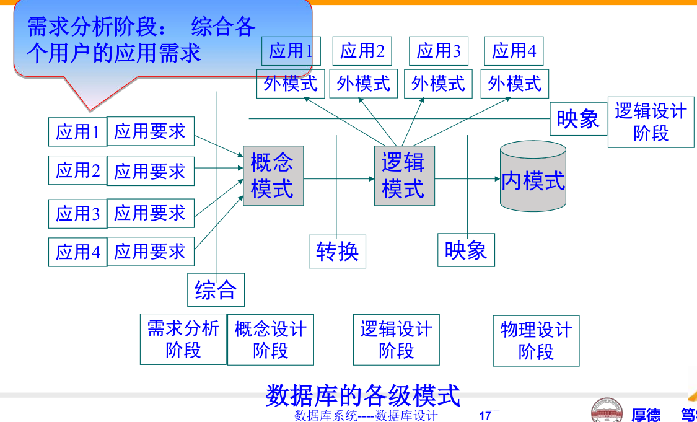


### 需求分析

方法论：结构化分析（SA方法）

**数据流图（DFD）**和**数据字典（DD）**是这一阶段最核心的工具，它们的关系是：

- **DFD（数据流图）**：画“数据怎么流动”。它是**宏观地图**，告诉你数据从哪来（输入）、经过谁处理（加工）、存到哪去（存储）、最后给谁（输出）。
- **DD（数据字典）**：解释“每个东西到底是什么”。它是**微观词典**，把DFD图里的每一个箭头、每一个方块的具体含义定死。
  - *比如：DFD上有个箭头叫“成绩”，DD里必须定义清楚——是百分制还是五级制？补考成绩怎么算？这决定了未来表字段的类型和约束。*

**规律总结**：**“先画图（定框架），后编字典（定细节）”**，两者缺一不可。


需求分析的“三大产出物”：

1. **信息要求**：系统里要存哪些核心数据（例如：学生、课程、教师）。
2. **处理要求**：数据要经历什么操作（例如：选课、打分、排课），以及响应时间要求（例如：查成绩不能超过1秒）。
3. **安全性与完整性要求**：谁能看什么数据（权限），数据不能违反什么规则（例如：年龄不能为负，学号必须唯一）。


### 概念结构设计

将需求分析得到的用户需求抽象为概念模型的过程

常用策略：

- **自底向上**（最常用）：先定义局部应用的概念结构，再集成为全局模型。
- **自顶向下**：先定义全局框架，再细化。
- **逐步扩张**：从核心结构逐步扩展。
- **混合策略**：结合自顶向下和自底向上。


**概念模型的作用**：

- 信息世界建模，是现实世界到机器世界的中间层次；
- 数据库设计的有力工具；
- 设计人员与用户交流的语言。


设计E-R图：

- **分类（Classification）**：定义对象型与值之间的“is member of”关系（如：学生 → 王平）。
- **概括（Generalization）**：定义子类与超类的“is subset of”关系，具有继承性（如：本科生、研究生 → 学生）。
- **聚集（Aggregation）**：定义对象内部组成，表示“is part of”关系（如：学生由学号、姓名等组成）。


E-R图优化：

- **优化目标**：
  - 实体个数尽可能少；
  - 属性尽可能少；
  - 联系无冗余。
- **消除冗余的方法**：
  - 分析方法（依据数据字典和数据流图）；
  - 规范化理论（函数依赖）


### 逻辑结构设计

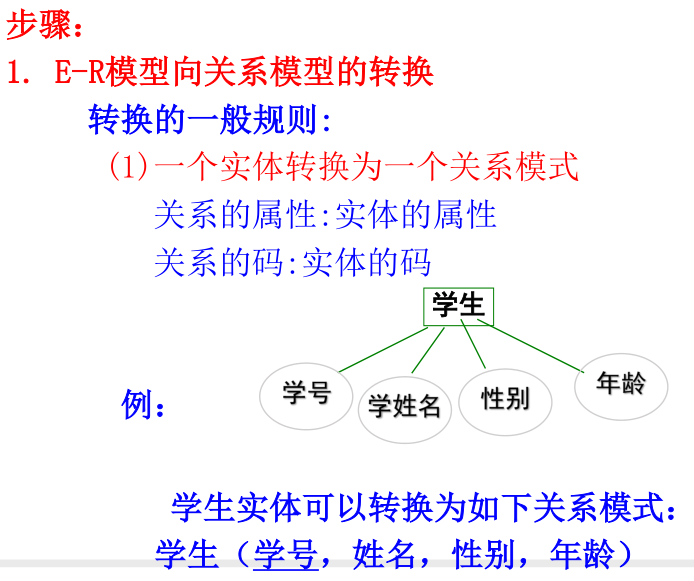


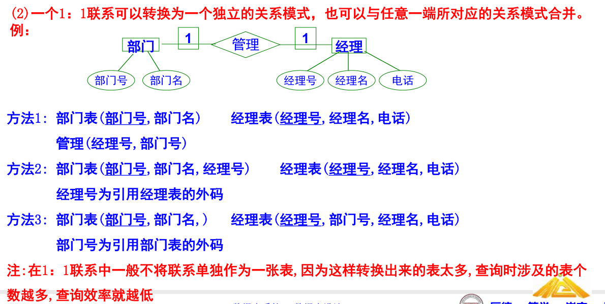


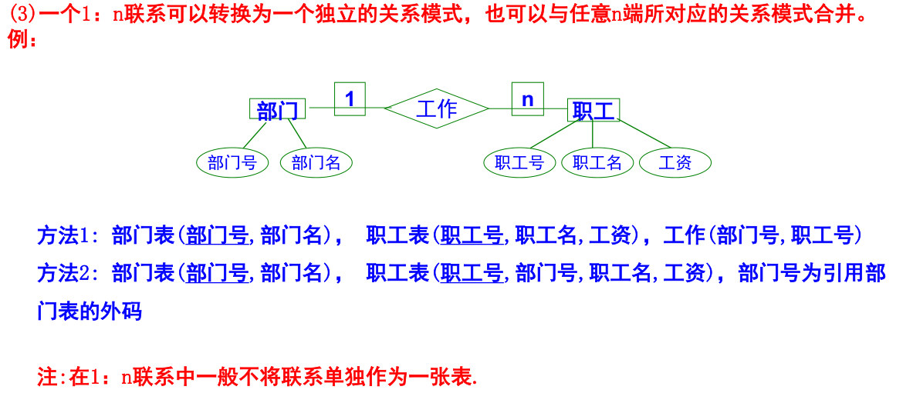


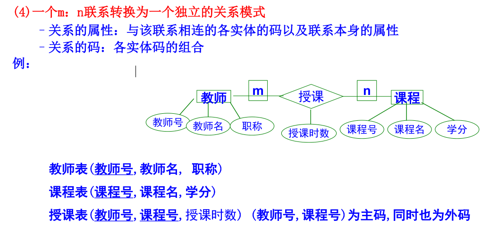


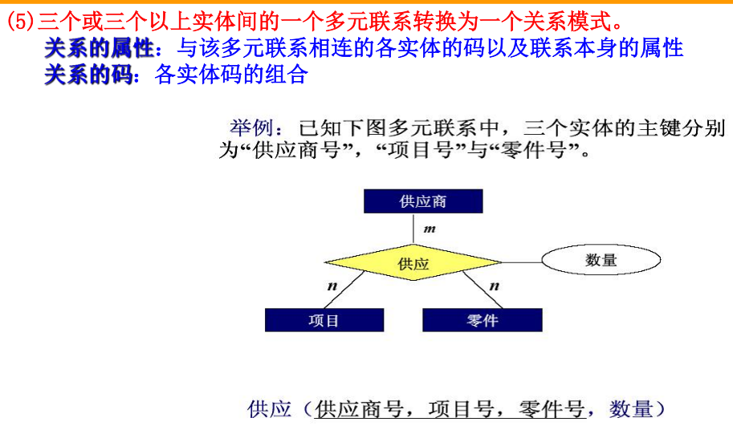


E-R图：

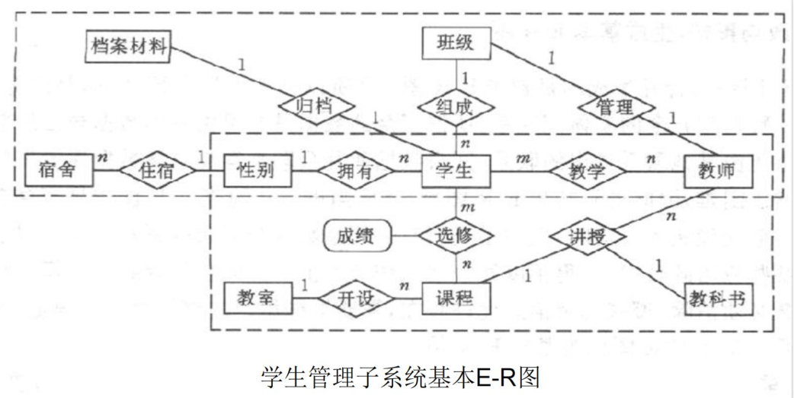


### 物理结构设计

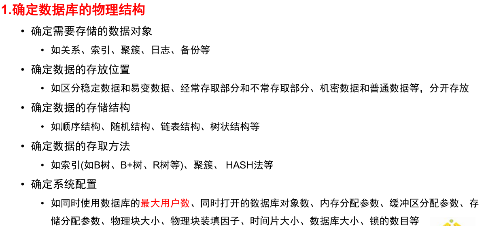


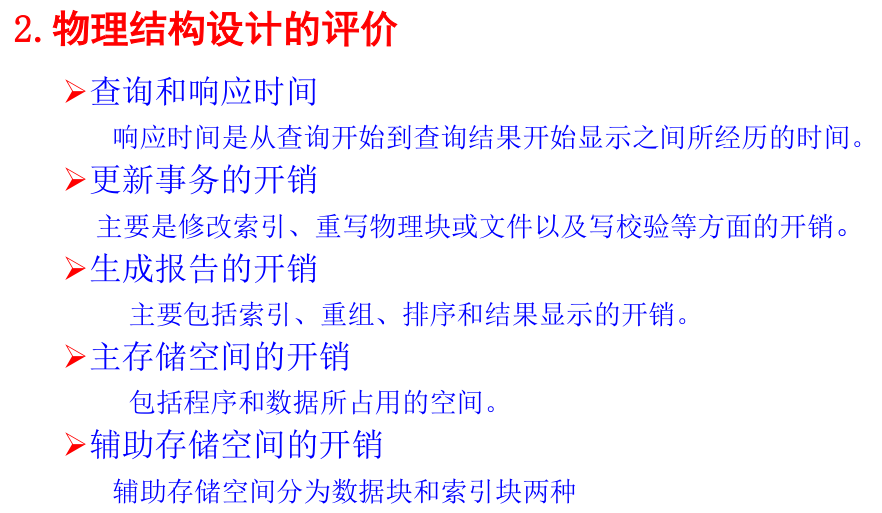


1. **索引法**：
   - 关键字：**B+树**、单个关系、可建多个。
   - 选择原则：查询条件、连接条件、聚集函数中出现频率高的属性。
2. **聚簇法**：
   - 关键字：**连续物理块**、一个关系只能一个聚簇、可用于多表连接。
   - 操作关联：ORDER BY、GROUP BY、UNION、DISTINCT。
3. **HASH法**：
   - 关键字：**HASH函数**、地址冲突、等值比较。
   - 适用前提：关系大小可预知，或DBMS提供HASH存取方法。


### 数据库运行和维护

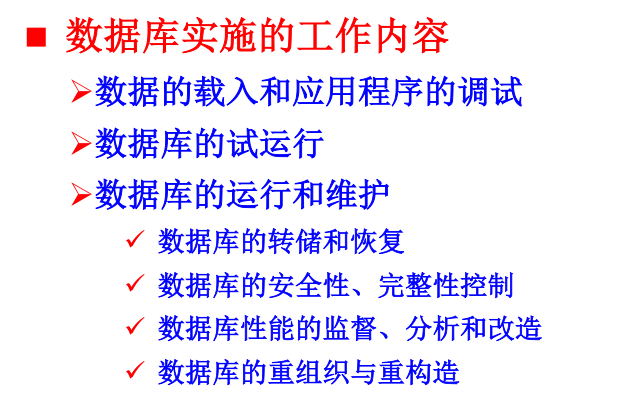


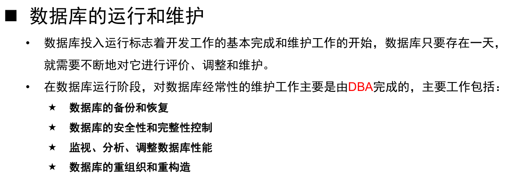


## 8.数据库编程


略过


## 9.关系查询处理和查询优化

关系查询优化是影响RDBMS性能的关键因素：

- 语义优化：利用模型的语义及完整性规则，优化查询。（用户/程序员优化？）
- 语法优化---逻辑层优化：利用语法结构，优化操作执行顺序；
- 执行优化---物理层优化：存取路径和执行算法的选择与执行次序优化；

### 查询优化

用户不用思考怎么做，系统比用户做得更好

代数优化代数优化代数优化

总代价=I/O代价 + CPU代价+ 内存代价 + 通信代价

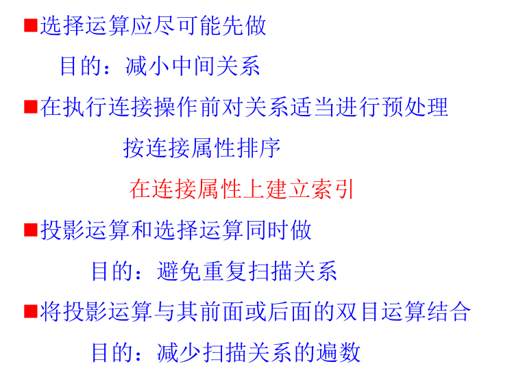

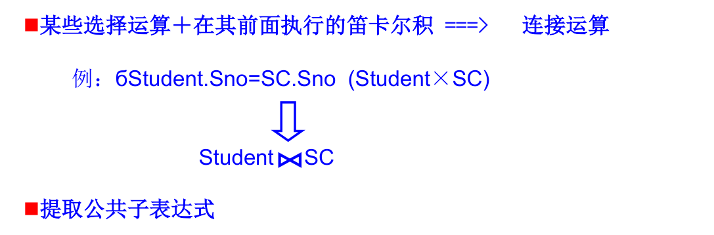


### 代数优化

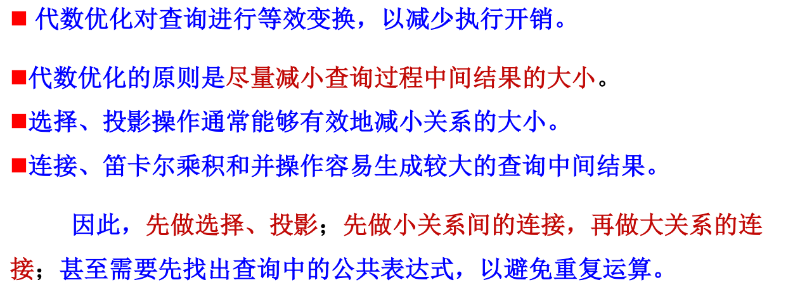

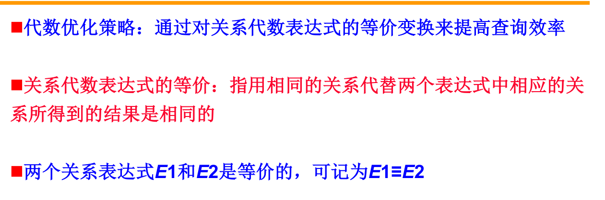


### 物理优化

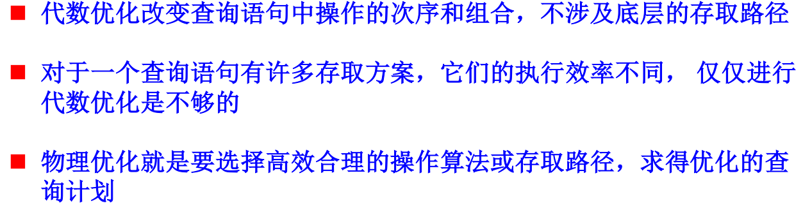


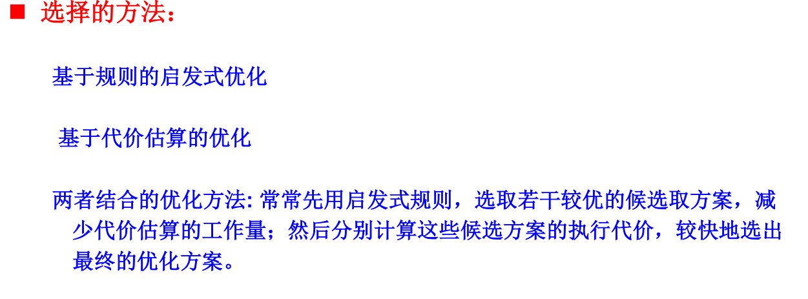

**基于启发式规则的存取路径选择优化：**

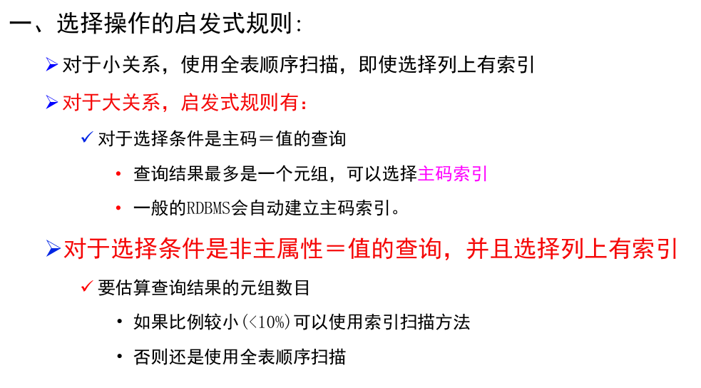

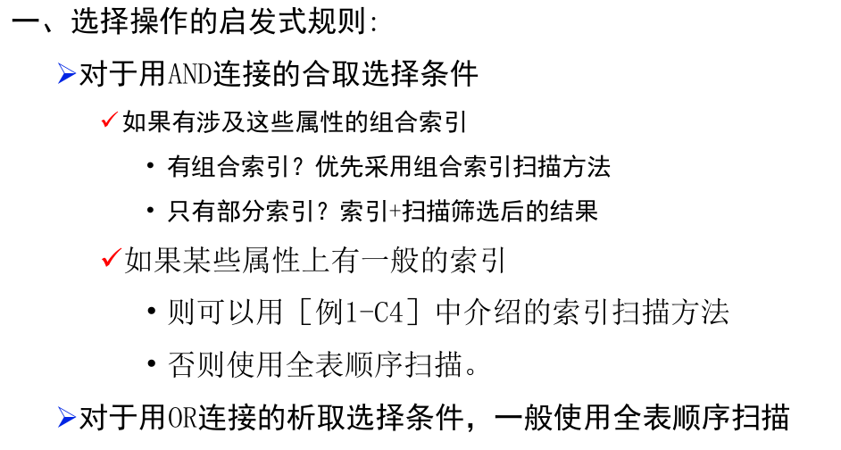

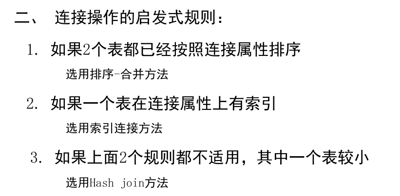

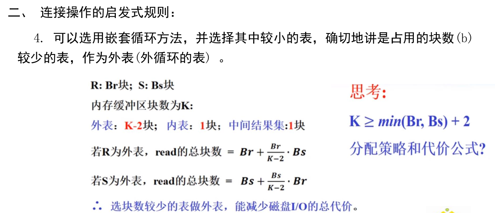


## 10数据库恢复技术

### 事务

是用户定义的一个**数据库操作序列**，这些操作**要么全做，要么全不做**，是一个不可分割的工作单位。

- **显式定义**：`BEGIN TRANSACTION` 开始，`COMMIT`（提交，永久生效）或 `ROLLBACK`（回滚，撤销所有修改）结束。
- **隐式定义**：当用户没有显式地定义事务时，数据库管理系统按缺省规定自动划分事务

四大特性（ACID）

| 特性       | 英文            | 核心含义                                                     | 数据库靠什么保证？                                           |
| :--------- | :-------------- | :----------------------------------------------------------- | :----------------------------------------------------------- |
| **原子性** | **A**tomicity   | 事务中所有操作要么全提交，要么全回滚。**绝不允许半途而废**。 | **恢复机制（Undo日志）**。若事务执行中发生故障，根据日志撤消（Undo）已做的修改。 |
| **一致性** | **C**onsistency | 事务执行前后，数据库从一个一致性状态变到另一个一致性状态（如转账总额不变）。 | 由应用程序的完整性约束 + 数据库机制共同保证。                |
| **隔离性** | **I**solation   | 一个事务的执行不被其他并发事务干扰。                         | **并发控制机制（锁/时间戳）**。                              |
| **持久性** | **D**urability  | 事务一旦提交，其对数据库的修改就是**永久性**的，即使系统崩溃也不丢失。 | **恢复机制（Redo日志）**。提交前将修改写入日志，崩溃重启后重做（Redo）。 |


### 数据库恢复

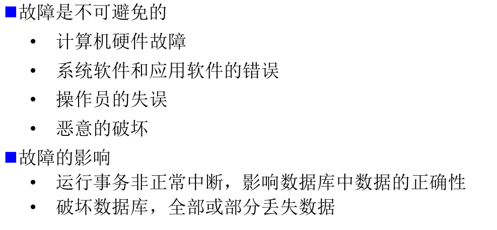

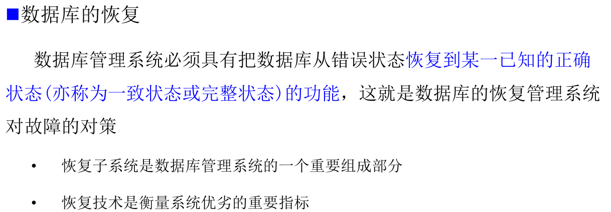


### 故障的种类

- 事务内部的故障：输入数据有误，溢出，死锁。通过撤销，回滚该事务
- 系统故障：停电，操作失误。**通过1撤销所有未完成事务 2重做所有已提交事务**
- 介质故障（硬故障）：磁盘损坏，磁场干扰。装入数据库发生介质故障前某个时刻的数据副本
- 计算机病毒


### 恢复的实现技术

分为**数据转储**和**登记日志文件**    一般会一起使用


数据转储：

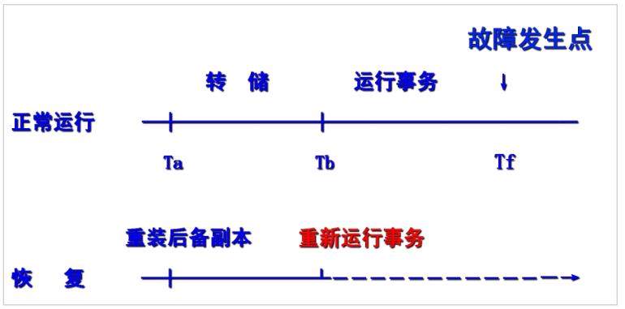

- 静态转储：开始转储时不存在对数据库的改动，一定是一致性的
- 动态转储：转储期间可以对数据库进行修改，需要配合日志文件实现恢复


- 海量转储：每次转储全部数据
- 增量转储：每次只转储上次更新过的数据

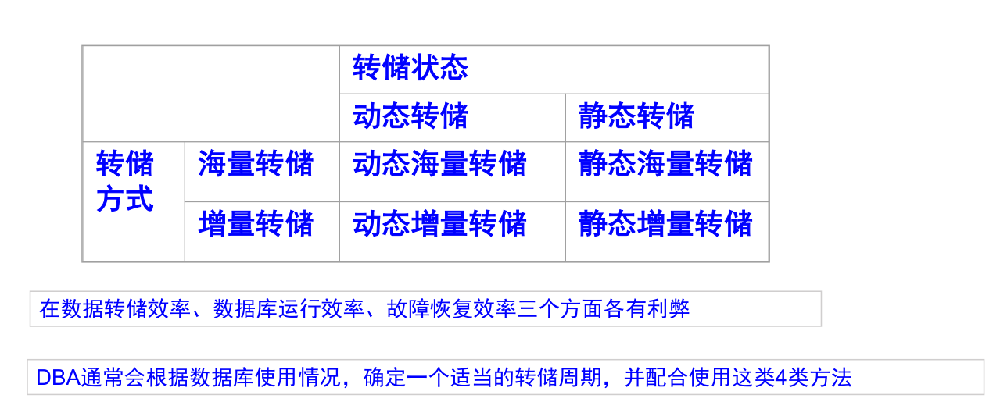


### 日志文件：


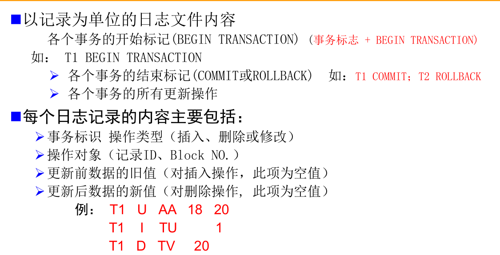


日志用途：

日志文件可以用来进行**事务故障恢复**和**系统故障恢复**，并协助后备副本进行介质故障恢复。

- 事务故障恢复和系统故障必须用日志文件
- 在动态转储方式中必须建立日志文件，后援副本和日志文件综合起来才能有效地恢复数据库
- 在静态转储方式中，也可以建立日志文件


**等级日志文件原则：**

- 登记的次序严格按并行事务执行的时间次序

- <p style='color:red;'>必须先写日志文件，后写数据库</p>


### 恢复策略

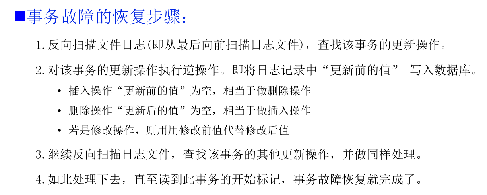

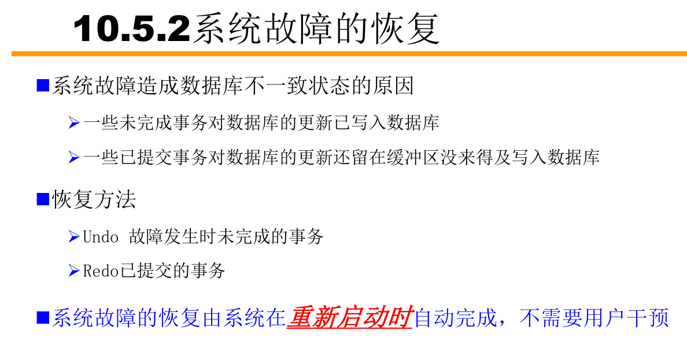

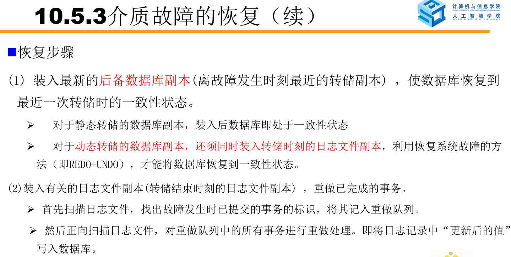

### 数据库镜像

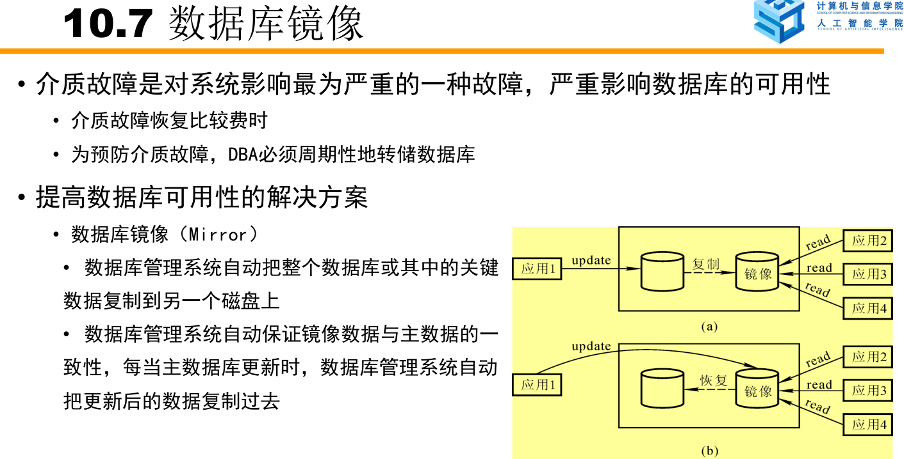

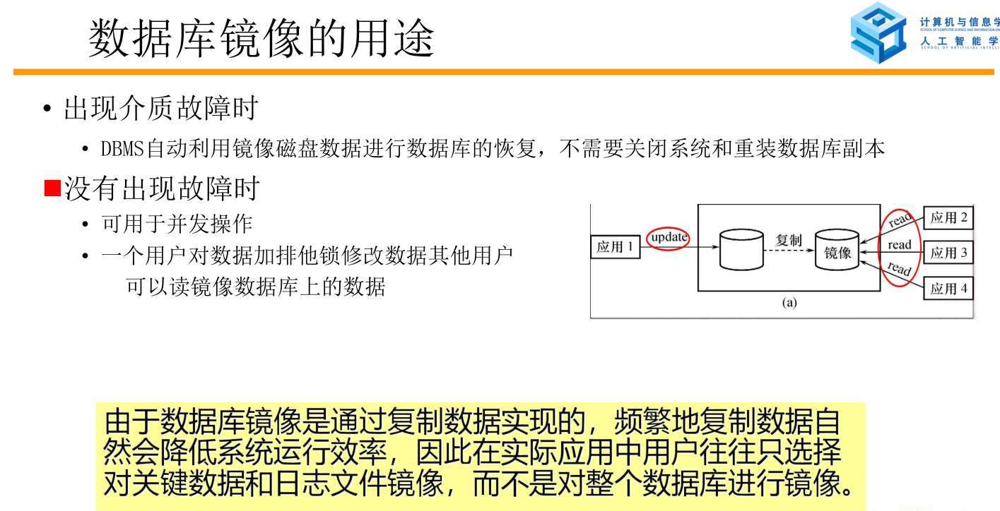
