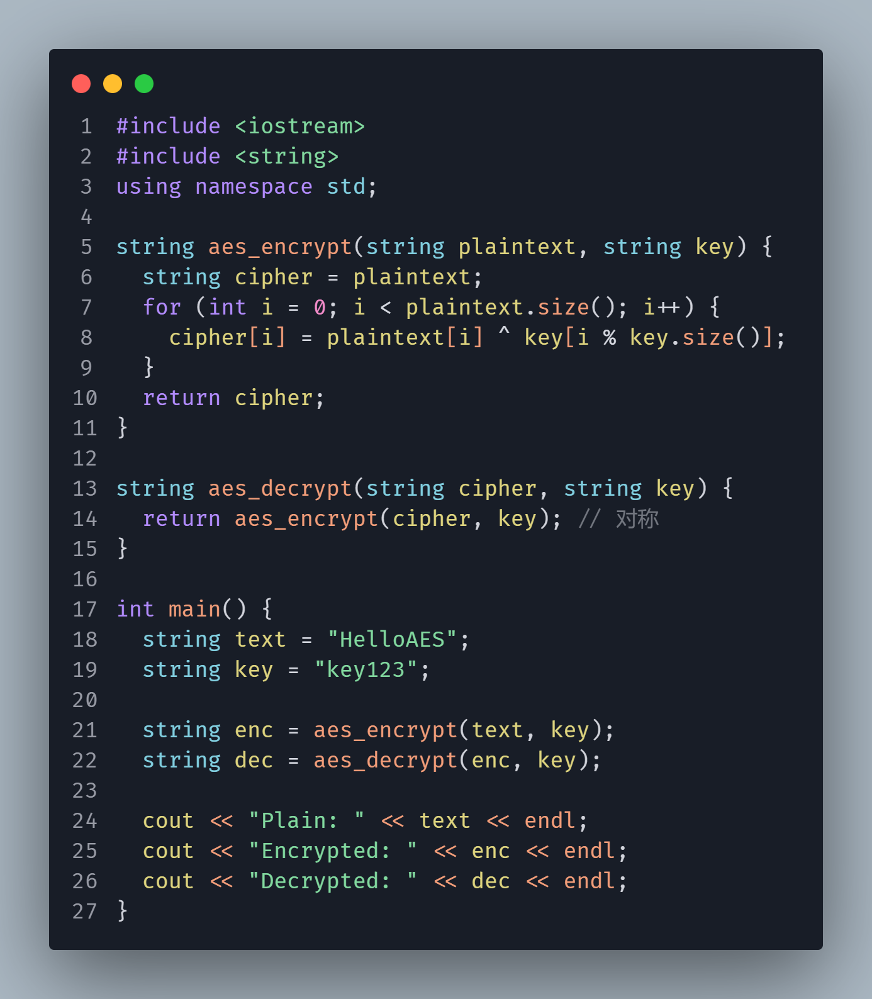
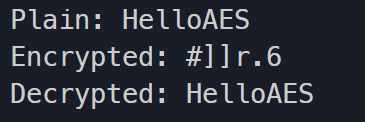
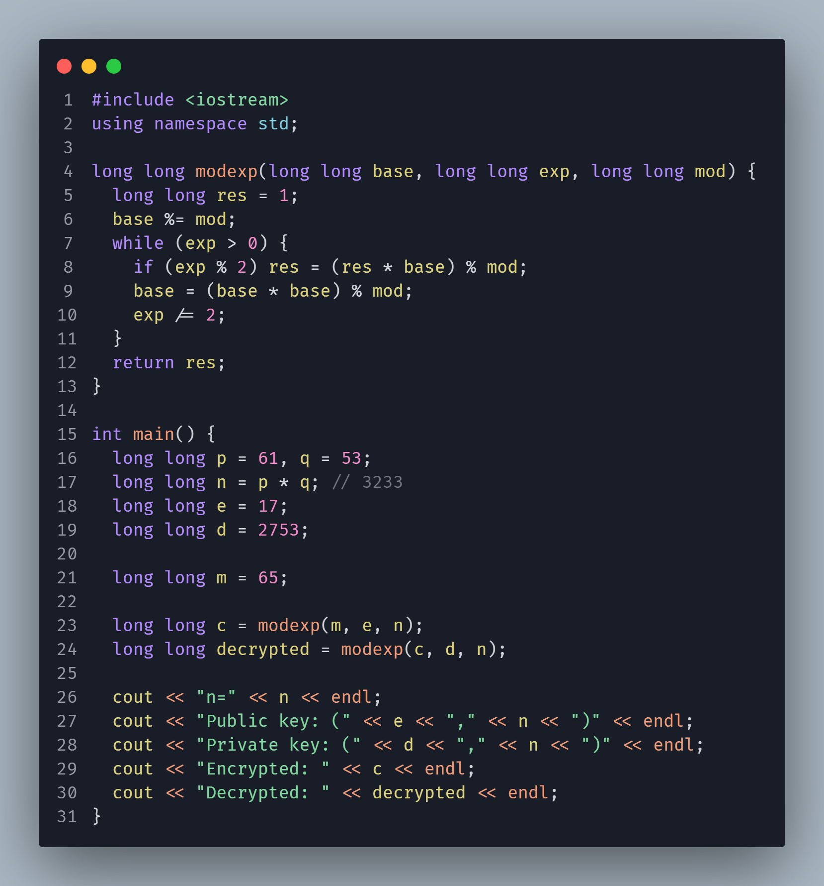
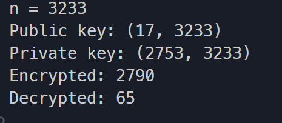
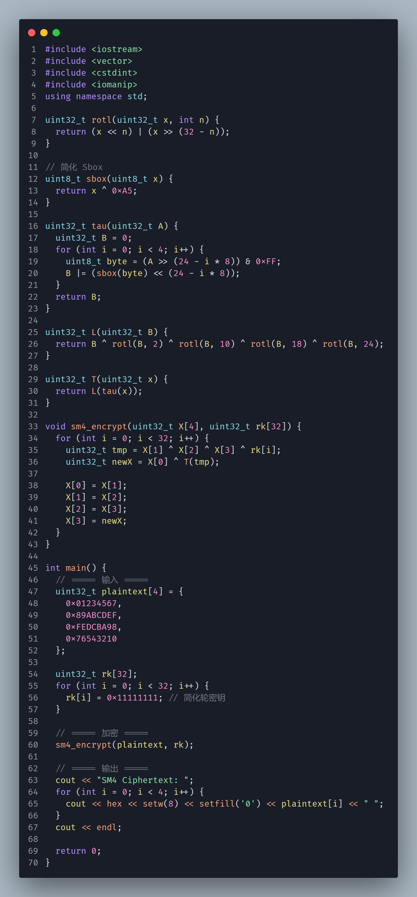
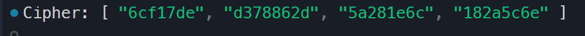
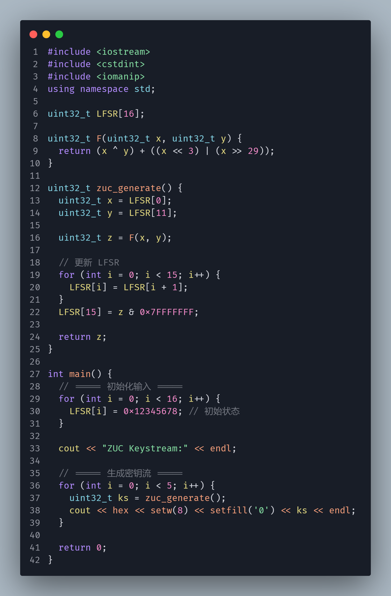
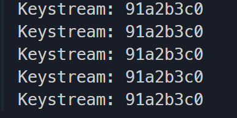
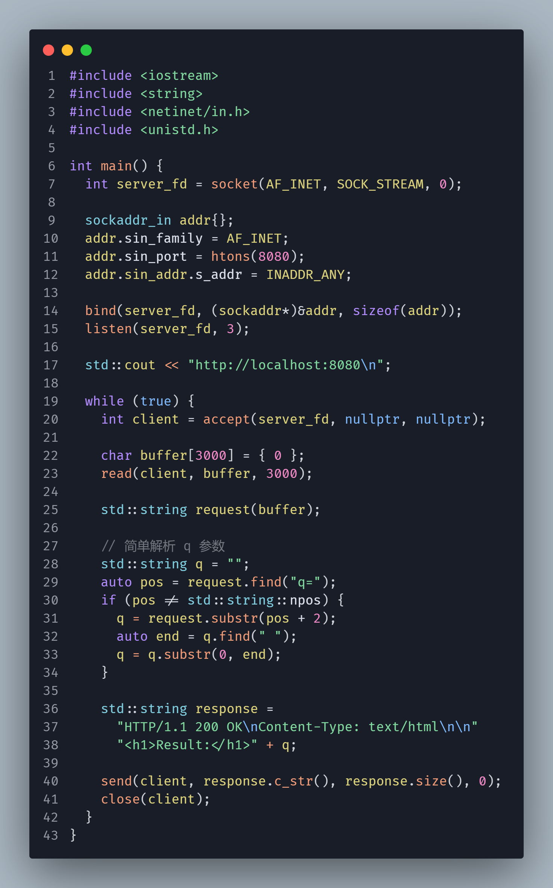
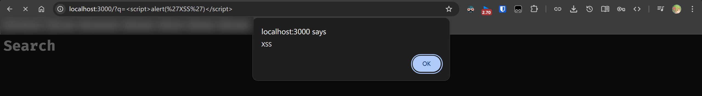

# 实验一：AES与RSA


## AES（对称加密）

AES 是一种**分组对称加密算法**：

- 分组大小：128 bit
- 密钥长度：128 / 192 / 256 bit
- 加密轮数：10 / 12 / 14

核心流程（以 AES-128 为例）：

1. 初始轮：AddRoundKey
2. 9轮：
   - SubBytes（字节代换）
   - ShiftRows（行移位）
   - MixColumns（列混合）
   - AddRoundKey
3. 最后一轮（无 MixColumns）

代码截图：




结果截图：



## RSA（非对称加密）

RSA 基于：

👉 **大整数分解困难问题**

生成过程：

1. 选两个大质数 p, q
2. n = p × q
3. φ(n) = (p-1)(q-1)
4. 选 e（通常 65537）
5. 求 d（模逆）

加密：

```
c = m^e mod n
```

解密：

```
m = c^d mod n
```


代码截图：




结果截图：




# 实验二：国密算法SM4、ZUC的代码实现

## SM4 算法（对称分组密码）

- 分组长度：128 bit
- 密钥长度：128 bit
- 结构：**分组密码（类似 AES，但结构不同）**
- 轮数：32 轮
- 设计类型：**非线性迭代结构（Feistel-like）**

不断用密钥 + 非线性变换，对数据进行 32 次“搅乱”

每一轮：

```
X[i+4] = X[i] ^ T(X[i+1] ^ X[i+2] ^ X[i+3] ^ rk[i])
```

其中：

- `rk[i]`：轮密钥
- `T()`：非线性变换（S盒 + 线性变换）

------


(1) S盒（非线性）

类似 AES，用于打乱数据

(2) 线性变换 L

```
L(B) = B ^ (B <<< 2) ^ (B <<< 10) ^ (B <<< 18) ^ (B <<< 24)
```

(3) 密钥扩展

把 128bit 密钥扩展成 **32个轮密钥**

1. 输入：128bit 明文 → 拆成 4 个 32bit
2. 进行 32 轮迭代
3. 输出时反序

代码：




结果：




## ZUC 算法（流密码）

生成一个“伪随机序列”，然后与明文 XOR

```
密文 = 明文 XOR 密钥流
```

------

内部结构

ZUC 由 3 部分组成：

(1) LFSR（线性反馈移位寄存器）

- 16 个 31bit 寄存器
- 用于生成状态

(2) Bit Reorganization（比特重组）

把 LFSR 数据重新组合

(3) 非线性函数 F

- 包含 S盒 + 运算
- 增强安全性

过程：

1. 初始化（key + IV）
2. LFSR warm-up（32轮）
3. 每轮生成 32bit keystream

代码截图：




结果：




# 实验三： 跨站脚本攻击(XSS)的代码实现

## XSS（Cross-Site Scripting）

攻击者把“恶意脚本”注入到网页中，让浏览器在“受信任上下文”执行

攻击原理（从浏览器角度）

浏览器对 HTML 的解析是“宽松”的：

```
<div>用户输入</div>
```

如果你把用户输入直接拼进去：

```
<div><script>alert(1)</script></div>
```

浏览器不会当“数据”，而是当“代码”并直接执行，所以黑客可以注入任何代码直接运行达到攻击的效果。


代码截图：




结果截图：

