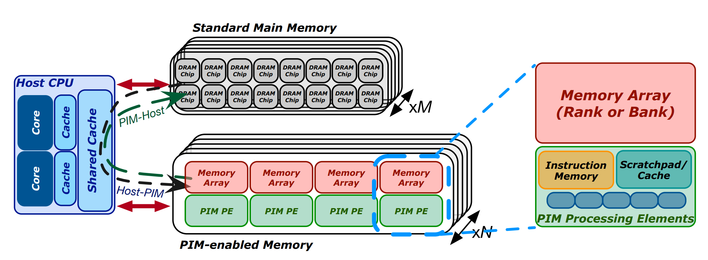

# 面向真实存内计算系统的机器学习训练研究

## 摘要

​		机器学习（Machine Learning, ML）算法 [1–6] 已经在科学与技术的诸多领域得到广泛应用，这是因为它们能够在最少人工干预的情况下，从经验中学习并不断改进。 这些算法通过迭代地更新模型参数来进行训练，以提升整体预测精度。然而，训练机器学习算法是一个计算密集型过程，需要大量的训练数据。在现有的处理器中心化系统（processor-centric systems，如 CPU、GPU）中，访问训练数据意味着需要在内存（memory）与处理器（processors）之间进行大量的数据传输（data movement），这不仅带来高能耗，还占用了大量的执行周期。若计算量与数据局部性（locality）不足以摊销这些数据传输的开销，那么数据传输就可能成为训练过程的性能瓶颈。

​		一种缓解数据传输（data movement）开销的方法是存内计算（processing-in-memory, PIM）[7–11]。这是一种以数据为中心（data-centric）的计算范式，其核心思想是在靠近或直接位于存储阵列（memory arrays）内部放置处理单元（processing elements）。存内计算（PIM）的研究已经持续了数十年 [9, 12–146]。然而，存储器技术上的挑战阻碍了其在商业产品中的成功落地。例如，动态随机存取存储器（DRAM）中有限的金属层数（metal layers）[147, 148]，使得传统的处理器设计在商用 DRAM 芯片（commodity DRAM chips）中变得不切实际 [149–152]。

​		真实的存内计算（PIM）系统直到最近才开始被制造并商业化。例如，UPMEM 公司推出了首个通用的商用 PIM 架构 [153–157]，其设计是在 DRAM 内存库（memory banks）附近集成小型顺序执行（in-order）核心。基于高带宽存储器（High-bandwidth memory, HBM）的 HBM-PIM [158, 159] 和加速 DIMM（Acceleration DIMM, AxDIMM）[160] 是三星提出的方案，并已通过真实原型进行了成功验证。HBM-PIM 在 HBM 层的内存库附近集成了单指令多数据（Single Instruction Multiple Data, SIMD）单元，这些单元支持乘加（multiply-add）与乘累加（multiply-accumulate）运算，其设计目标是加速神经网络推理。AxDIMM 则是一种近 rank（near-rank）方案，它在 DDR 模块上集成 FPGA 结构，用于加速特定任务（例如推荐系统推理）。加速器内存（Accelerator-in-Memory, AiM）[163] 是 SK Hynix 基于 GDDR6 的 PIM 架构，配备了专门用于乘累加与激活函数（activation functions）的单元，以支持深度学习。HB-PNM [164] 是阿里巴巴提出的一种基于 3D 堆叠（3D-stacked）的 PIM 架构，它将一层 LPDDR4 内存与包含专用加速器的逻辑层堆叠在一起，用于推荐系统。

​		这五种真实存在的存内计算（PIM）系统具有一些重要的共同特征，如图1所示。首先，系统中存在一个主机处理器（host processor，如 CPU 或 GPU），通常带有深层缓存层次结构（deep cache hierarchy），它能够访问（1）标准主存（standard main memory），以及（2）支持 PIM 的存储器（PIM-enabled memory，即 UPMEM DIMMs、HBM-PIM 堆叠、AxDIMM DIMMs、AiM GDDR6、HB-PNM LPDDR4）。其次，支持 PIM 的存储芯片中包含多个 PIM 处理单元（PIM processing elements, PIM PEs），它们能够以比主机处理器更高的带宽和更低的延迟访问存储器（包括存储库 memory banks 或 rank）。第三，这些 PIM 处理单元（可能是通用核心 general-purpose cores、SIMD 单元、FPGAs 或专用处理器 specialized processors）运行频率通常仅为几百兆赫兹，且寄存器数量较少，同时缓存（cache）或暂存存储器（scratchpad memory）容量也相对较小（甚至可能没有）。第四，处理单元之间可能无法直接通信（例如位于不同芯片中的 UPMEM DPUs、HBM-PIM PCUs 或 AiM PUs），它们之间的通信需要通过主机处理器完成。图1展示了这样一种最先进的存内计算系统的高层结构视图。

**图1：最先进的存内计算系统（processing-in-memory, PIM）的高层结构视图。主机 CPU 可以访问 M 个标准内存模块（standard memory modules）和 N 个支持 PIM 的内存模块（PIM-enabled memory modules）。**

​		本研究的目标是量化通用 PIM 架构在机器学习算法训练中的潜力。为此，我们在一个包含支持 PIM 内存（PIM-enabled memory）的通用以内存为中心系统（memory-centric system）上实现了四种具有代表性的经典机器学习算法（线性回归 linear regression [165, 166]、逻辑回归 logistic regression [165, 167]、决策树 decision tree [168]、K 均值聚类 K-means clustering [169]），具体使用的是 UPMEM PIM 架构 [153–157]。我们的研究未包含深度学习算法的训练，因为 GPU 和 TPU 已经成为深度学习训练的首选且高度优化的加速器 [89, 170–175]。

​		我们对机器学习算法的 PIM 实现遵循了近期文献中的 PIM 编程建议 [154–156, 176]。为了克服现有通用 PIM 架构的限制（例如有限的指令集、相对简单的流水线、较低的运行频率），我们应用了多种优化措施，并充分利用 PIM 的固有优势（例如大内存带宽、高速内存访问）。

​		我们在一个包含支持 PIM 内存（PIM-enabled memory）的真实以内存为中心系统（memory-centric system）上，对 PIM 实现的机器学习算法在训练精度、性能和可扩展性方面进行了评估 [153, 176, 177]。我们的实验在一个真实的 PIM 系统 [153] 上进行，该系统配备了 2,524 个 PIM 核心，运行频率为 425 MHz，并拥有 158 GB 的 DRAM 内存。

​		我们的实验性真实系统评估提供了新的观察结果和见解，包括以下几点：

- 在处理器中心化系统中表现出内存受限（memory-bound）特性的机器学习训练任务，在 PIM 系统中可以通过（1）定点数据表示（fixed-point data representation）、（2）量化（quantization）[178, 179] 和（3）混合精度实现（hybrid precision implementation）[163, 180]（几乎不损失精度）获得显著收益，从而缓解对浮点和高精度（32 位和 64 位）算术运算的原生支持不足的问题。
- 对于需要复杂激活函数（如 sigmoid）[181] 的机器学习训练任务，当 PIM 系统不具备这些激活函数的原生支持时，可以利用查找表（lookup tables, LUTs）[98, 182, 183] 替代函数近似（如泰勒展开 Taylor series）[184]，从而提高计算效率。
- 可以通过合理布置数据，使 PIM 核心访问其附近的内存库（memory banks）呈流式（streaming）模式，从而更好地利用 PIM 的内存带宽。
- 对于拥有大规模训练数据集的机器学习训练任务，将 PIM 核心与内存库结合并扩大 PIM 支持的内存容量，可以获得显著性能提升。训练数据可以保留在内存中，无需在训练过程的每次迭代中移动到主机处理器（如 CPU、GPU）。即便 PIM 核心需要通过主机处理器传递中间结果，只要合理重叠计算与通信，这部分通信开销也是可接受的。

​		我们将线性回归、逻辑回归、决策树和 K 均值聚类在 PIM 系统上的实现与其最先进的 CPU 和 GPU 对应实现进行了对比。我们观察到，对于内存受限（memory-bound）的机器学习训练任务，当 ML 工作负载所需的操作能够被 PIM 硬件原生支持（或可以通过高效的查找表 LUT 实现替代）时，配备 PIM 支持内存（PIM-enabled memory）的以内存为中心系统（memory-centric systems）能够显著优于处理器中心化系统（processor-centric systems）。

​		我们的扩展论文 [185] 包含：（1）对我们在 PIM 系统上实现的机器学习工作负载的详细描述；（2）对这些实现进行的全面评估以及与最先进 CPU 和 GPU 系统的对比；（3）关于机器学习工作负载在 PIM 系统上的适用性、针对 ML 软件开发者的编程建议，以及对未来 PIM 架构的建议与提示。我们计划将所有 PIM 上的机器学习训练实现、训练数据集以及评估脚本开源。

## 关键词

机器学习（machine learning）、存内计算（processing-in-memory, PIM）、回归（regression）、分类（classification）、聚类（clustering）、基准测试（benchmarking）

## 致谢

我们感谢工业合作伙伴的慷慨支持，包括 ASML、Facebook、Google、华为（Huawei）、Intel、Microsoft 和 VMware。我们也感谢半导体研究公司（Semiconductor Research Corporation）和苏黎世联邦理工学院未来计算实验室（ETH Future Computing Laboratory）的支持。本扩展摘要作为受邀论文发表于 2022 年 IEEE 计算机学会年度 VLSI 研讨会（ISVLSI），是我们近期工作 [185] 的总结版本。