## 一：软件工程学概述

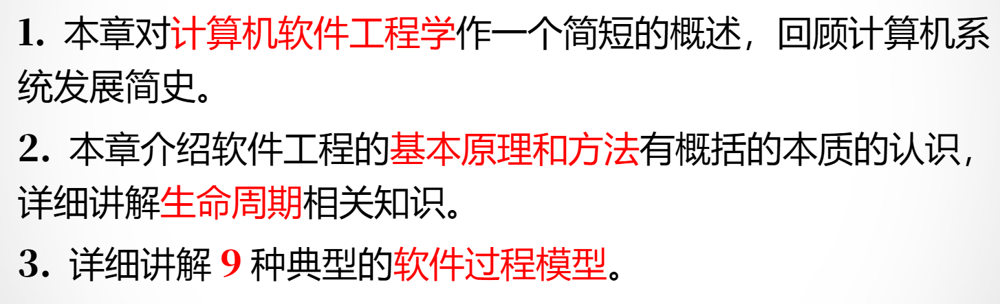

### 软件工程概述

软件工程是指导计算机软件开发和维护的一门工程学科。采用工程的概念、原理、技术和方法来开发与维护软件，把经过时间考验而证明正确的管理技术和当前能够得到的最好技术方法结合起来，以经济地开发出高质量的软件并有效地维护它，这就是软件工程。

### 软件工程基本原理

- 用分阶段的生命周期计划严格管理
- 坚持进行阶段评审
- 实行严格的产品控制
- 朩用现代程序设计技术
- 结果应能清楚地审查
- 开发小组的人员应该少而精
- 承认不断改进软件工程实践的必要性

### 软件工程的方法

分为：工具（为运用方法而提供的自动的或半自动的软件工程支撑环境），方法（完成软件开发的各项任务的技术方法，回答“怎样做”的问题），过程（为了获得高质量的软件所需要完成的一系列任务的框架，它规定了完成各项任务的工作步骤）

### 软件生命周期

**软件定义**、**软件开发**和**软件维护**3个时期组成

软件定义时期的任务是：

- 确定软件开发工程必须完成的总目标；
- 确定工程的可行性；
- 导出实现工程目标应采用的策略及系统必须完成的功能；
- 估计完成该工程需要的资源和成本，并制定工程进度表。
- 这个时期的工作通常又称为系统分析，由系统分析员负责完成。

1、软件定义时期通常进一步划分成3个阶段，即**问题定义、可行性研究和需求分析**。

2、开发时期具体设计和实现在前一个时期定义的软件，它通常由下述4个阶段组成：**总体设计，详细设计，编码和单元测试，综合测试**。其中前两个阶段又称为系统设计，后两个阶段又称为系统实现。

3、维护时期的主要任务是使软件持久地满足用户的需要。

生命周期八个阶段基本任务：

1. 问题定义
2. 可行性研究
3. 需求分析
4. 总体设计
5. 详细设计
6. 编码&单元测试
7. 综合测试
8. 软件维护

### 9种软件过程模型

**瀑布模型（Waterfall Model）**

特点

- 阶段间具有顺序性和依赖性
- 强调文档驱动
- 带有反馈环
- 推迟实现，先分析设计后编码
- 每阶段结束都需评审

优点

- 开发过程规范
- 文档完整清晰
- 质量控制严格
- 易于管理

缺点

- 过度依赖需求说明文档
- 难以适应需求变化
- 用户参与度低
- 后期修改代价高

------

**V模型（V Model）（瀑布模型变体）**

特点

- 瀑布模型变体
- 测试活动与开发阶段对应
- 强调验证与确认

优点

- 测试规划较早
- 软件质量较高
- 缺陷发现较及时

缺点

- 灵活性差
- 不适合需求频繁变化
- 返工成本较高

------

**快速原型模型（Rapid Prototype Model）**

特点

- 快速建立可运行原型
- 通过用户交互完善需求
- 原型仅实现部分功能

优点

- 能准确获取用户需求
- 减少返工
- 开发效率较高
- 降低开发成本

缺点

- 容易忽略系统整体设计
- 原型可能质量较低
- 用户可能误认为原型即最终产品

------

**增量模型（Incremental Model）**

特点

- 软件按多个增量逐步开发
- 每个增量完成特定功能
- 核心功能优先交付

优点

- 能快速交付部分可用系统
- 用户易于学习和适应
- 风险较低
- 重要功能测试更充分

缺点

- 增量集成困难
- 要求开放的软件体系结构
- 架构设计复杂

------

**螺旋模型（Spiral Model）**

特点

- 结合瀑布模型与原型模型
- 风险驱动
- 每轮循环都进行风险分析
- 迭代开发

优点

- 风险控制能力强
- 支持软件复用
- 测试更加合理
- 适合大型复杂项目

缺点

- 依赖风险评估经验
- 管理复杂
- 开发成本较高

------

**喷泉模型（Fountain Model）**

特点

- 面向对象开发
- 阶段之间可交叠
- 强调迭代与无缝开发
- 维护时间较短

优点

- 灵活性高
- 支持软件复用
- 适合面向对象系统

缺点

- 管理难度大
- 开发过程复杂
- 对开发人员要求高

------

**Rational统一过程（RUP）**

特点

- 迭代式开发
- 用例驱动
- 体系结构为中心
- 使用UML可视化建模
- 生命周期划分为4个阶段

优点

- 能适应需求变化
- 支持构件复用
- 软件质量高
- 管理规范

缺点

- 过程复杂
- 学习成本高
- 文档工作量较大

------

**基于构件的开发模型（CBSE）**

特点

- 以可复用构件为核心
- 强调软件组装
- 提高软件复用率
- 降低编码工作量

优点

- 开发效率高
- 降低开发成本
- 提高可靠性
- 易于维护

缺点

- 构件兼容问题复杂
- 构件获取困难
- 对体系结构依赖强

------

**敏捷过程与极限编程（Agile / XP）**

特点

- 快速迭代
- 欢迎需求变化
- 强调人与沟通
- 小步快跑持续交付
- XP强调结对编程、重构、持续测试

优点

- 响应变化能力强
- 用户参与度高
- 交付速度快
- 软件更贴近用户需求

缺点

- 文档可能不足
- 对团队协作要求高
- 不适合超大型项目
- 过程难以标准化

------

**微软过程模型（Microsoft Process）**

特点

- 快速循环递进开发
- 风险驱动
- 小型团队并行开发
- 强调原型验证
- 生命周期包括规划、设计、开发、稳定、发布阶段

优点

- 产品稳定性高
- 风险控制较好
- 开发效率高
- 易于快速迭代

缺点

- 对团队协作要求高
- 管理复杂
- 过程控制成本较高

## 二：可行性研究

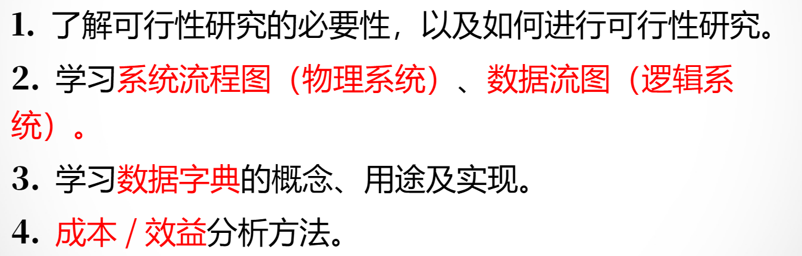

### 可行性研究必要性

就是用**最小的代价**在**尽可能短的时间**内确定问题是否能够解决

### 系统流程图（物理系统）

表达数据在系统各个部件之间流动的情况，而不是对数据加工处理的过程（自顶而下，从左到右）

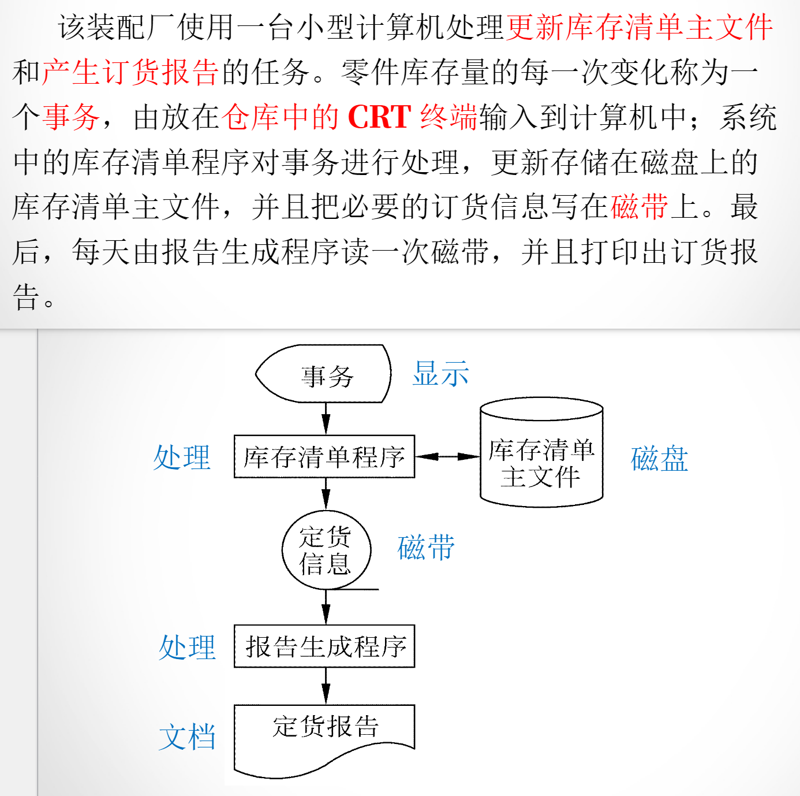

### 数据流图（逻辑系统）

描绘**信息流和数据**从输入移动到输出的过程中所经受的**变换**

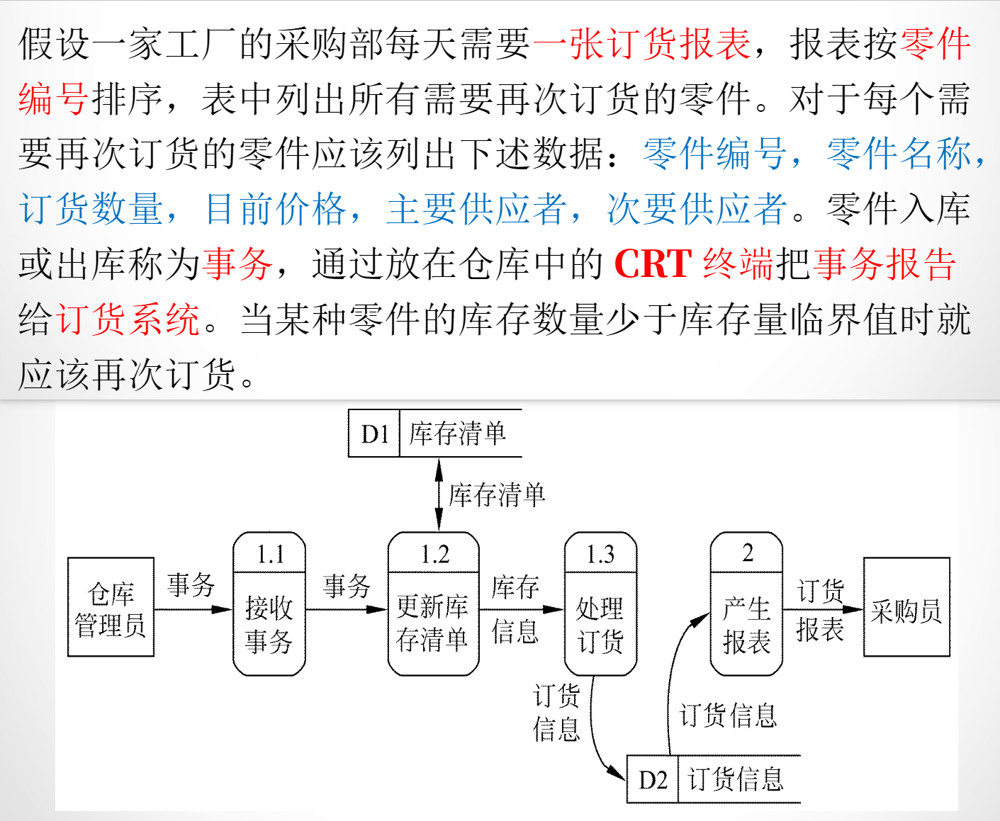

### 数据字典

关于数据的信息集合，对数据流图中包含的所有元素定义的集合

### 成本/效益分析

- 代码行技术（每行代码成本 * 代码行数）
- 任务分解技术（每个小任务成本加和）
- 自动估计成本技术（历史参考）

需要考虑到：

- 货币的时间成本
- 投资回收期
- 纯收入
- 投资回报率

## 三：需求分析

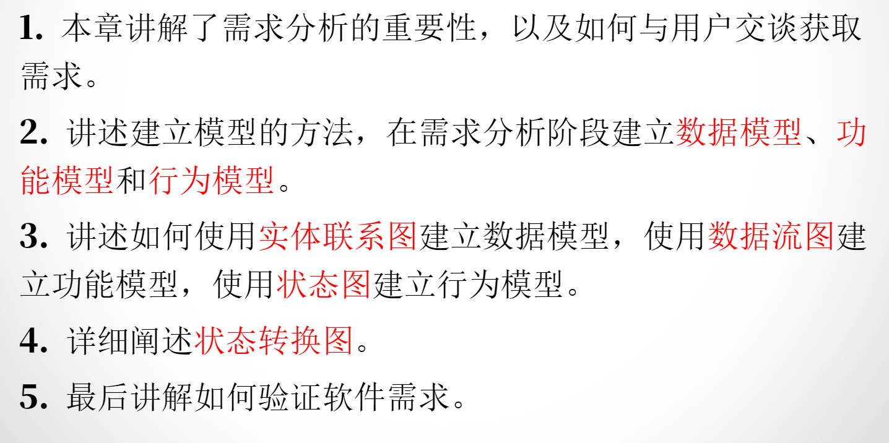

- 数据模型：实体联系图
- 功能模型：数据流图
- 行为模型：状态图

## 五：总体设计

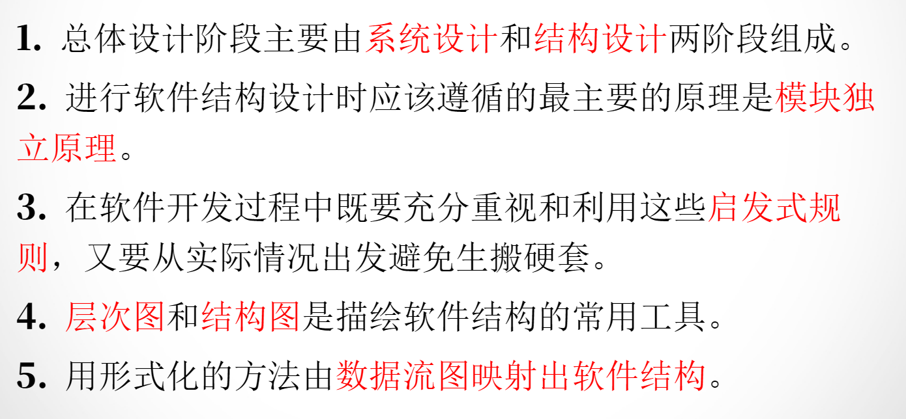

总体设计由**系统设计**和**结构设计**两阶段组成

### 模块独立原理

每个程序都相应地有一个最适当的模块数目M，使得系统的开发成本最小

多于或者少于M都会导致开发成本提高

### 启发式规则

- 改善软件结构提高模块独立性
- 模块规模应该适中
- 深度、宽度、扇出和扇入都应适当
- 模块的作用域应该在控制域之内
- 降低模块接口的复杂程度
- 设计单入口单出口的模块
- 模块功能可以预测

### 层次图

层次图用来描绘软件的层次结构。数据结构的层次方框图相同，但是表现的内容却完全不同。层次图很适于在自顶向下设计软件的过程中使用。

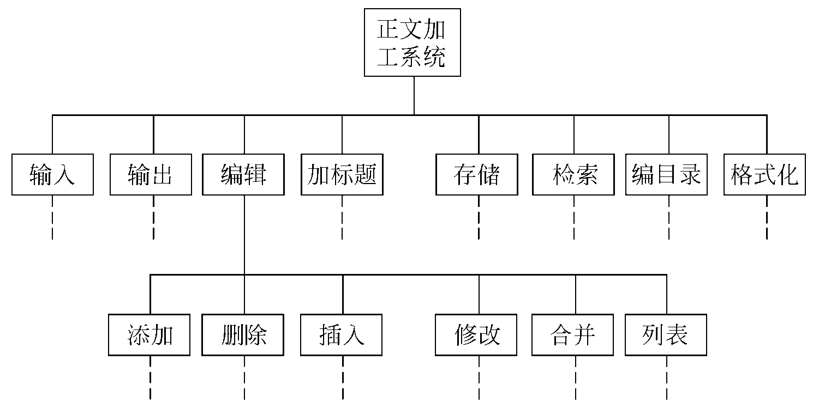

### 结构图

图中一个方框代表一个模块，框内注明模块的名字或主要功能；方框之间的箭头（或直线）表示模块的调用关系。尾部是空心圆表示传递的是数据，实心圆表示传递的是控制信息。

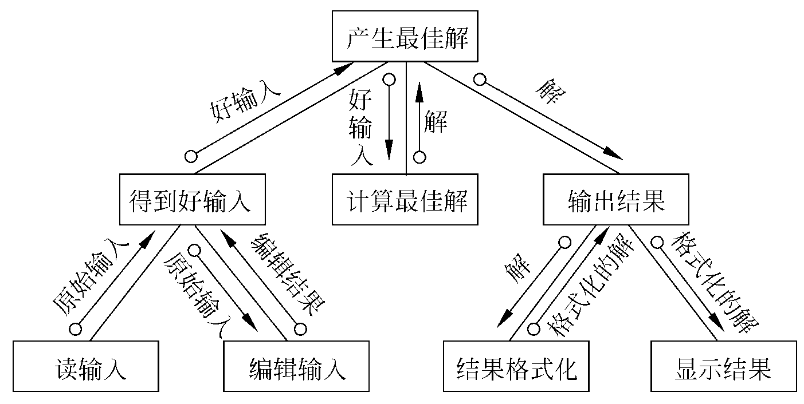

## 六：详细设计

### 结构程序设计技术

如果只允许使用顺序、IF-THEN-ELSE型分支和DO-WHILE型循环这3种基本控制结构，则称为**经典的结构程序设计**；

如果除了上述3种基本控制结构之外，还允许使用DO-CASE型多分支结构和DO-UNTIL型循环结构，则称为**扩展的结构程序设计**；

如果再允许使用LEAVE（或BREAK ）结构，则称为**修正的结构程序设计**。

都是尽量减少GOTO语句的使用

### 人机界面设计

设计问题：

1. 系统响应时间（控制好长度和易变形）
2. 用户帮助实施（帮助菜单，HELP指令）
3. 出错信息处理（出错，警告信息）
4. 命令交互（不用GUI，转而用CLI）

### 数据设计

1. 文件设计：哪些数据适合选择文件存储，哪些数据适合哪种文件组织方式
2. 数据库设计：关系/非关系型数据库

### 面向数据结构的设计方法

### 环形复杂度

定量度量程序复杂程度的方法很有价值：
① 把程序的复杂程度乘以适当常数即可估算出软件中错误的数量以及软件开发需要用的工作量；
② 定量度量的结果可以用来比较两个不同的设计或两个不同算法的优劣；
③ 程序的定量的复杂程度可以作为模块规模的精确限度。

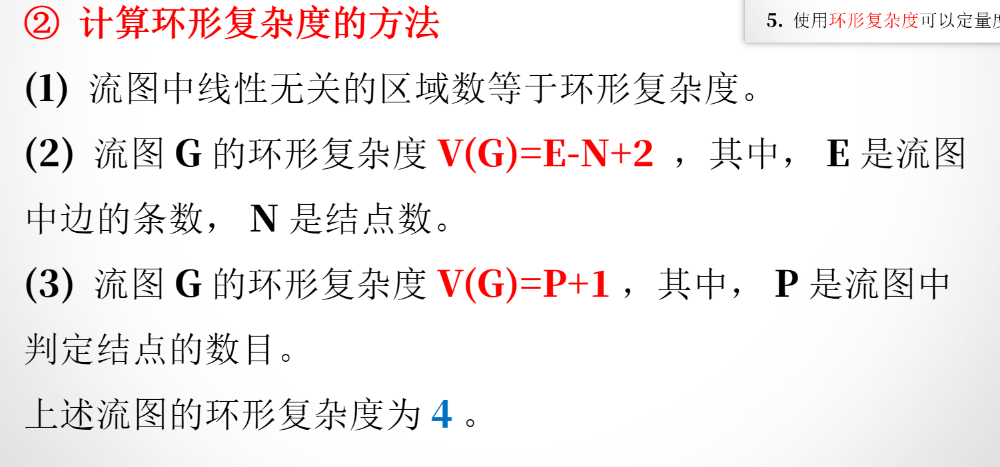

## 七：实现

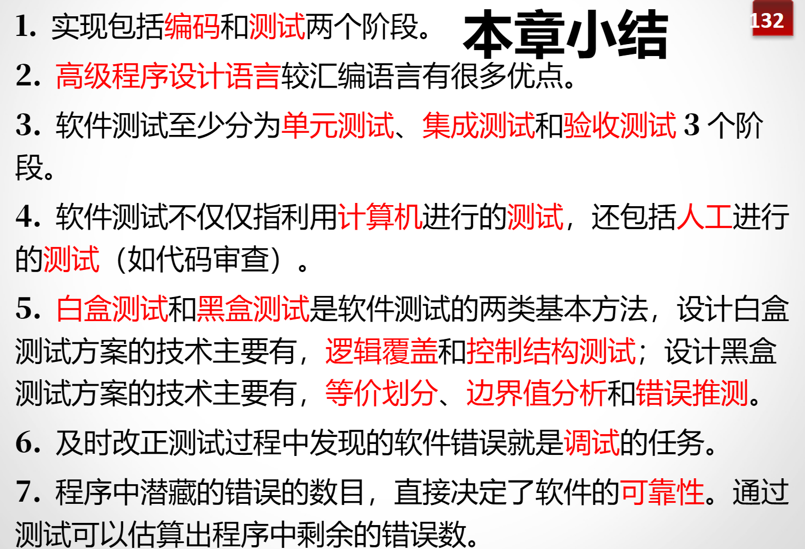

### 编码

1. 程序内部的文档（注释，注解，代码规范）
2. 数据说明
3. 语句构造
4. 输入输出（检查合法性，格式一致）
5. 效率

### 测试

- 单元测试 → 测零件
- 集成测试 → 测组合
- 验收测试 → 测成品

采用计算机测试+人工测试（Code Review）

### 白盒测试

能看到内部代码，关注代码怎么写的

- 逻辑覆盖：让程序中的逻辑路径尽量被执行到
- 控制结构测试：针对程序控制结构进行测试

### 黑盒测试

不看代码，只看输入输出，关注结果对不对

- 等价划分：同一类数据效果差不多，每类挑一个测
- 边界值分析：测试临界数据
- 错误推测：靠经验猜哪里容易出错（指针异常，内存泄露，负数）

### 调试

调试（也称为纠错）**作为成功测试的后果出现**，即调试是**在测试发现错误之后排除错误的过程**

方法：

- 蛮干法：比如在代码里到处打印日志，穷举错误
- 回溯法：顺藤摸瓜，倒着往前推
- 原因排错法：归纳演绎，用逻辑推理排除其他原因

## 八：维护

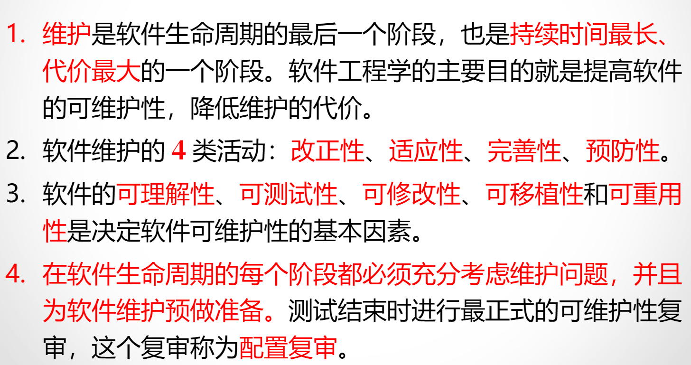

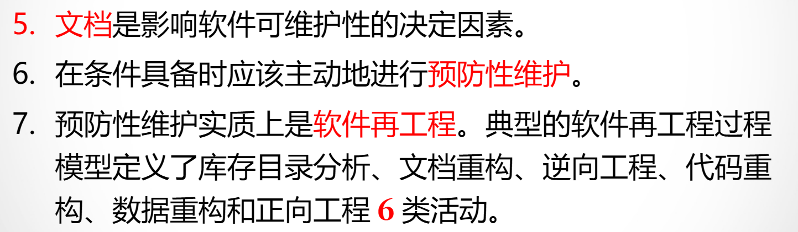

这个阶段是软件生命周期的最后一个阶段，其基本任务是保证软件在一个相当长的时期能够正常运行，持续时间最长，代价最大的一个阶段。

### 软件维护的四类活动

- 改正性：修复软件中的错误
- 适应性：为了适应外部环境变化，对软件进行修改兼容
- 完善性：添加新功能，修改已有功能
- 预防性：提前发现潜在问题，防止未来出故障

### 决定软件可维护性的因素

- 可理解性：读者理解软件的结构、功能、接口和内部处理过程的难易程度
- 可测试性：有良好的文档，调试工具，测试过程（用程序复杂度衡量）
- 可修改性：软件容易修改的程度（低耦合，高聚合）
- 可移植性：把与硬件、操作系统以及其他外部设备有关的程序代码集中放到特定的程序模块中
- 可重用性：同一事物不做修改或稍加改动就在不同环境中多次重复使用

### 文档

是影响软件可维护性的决定因素，比代码重要

### 预防性维护

在条件具备时应该主动进行预防性维护

实质上是**软件再工程**。

分为6类活动：

1. 库存目录分析
2. 文档重构
3. 逆向工程
4. 代码重构
5. 数据重构：优化数据结构、数据库设计、字段组织方式等。
6. 正向工程

## 九：面向对象方法学引论

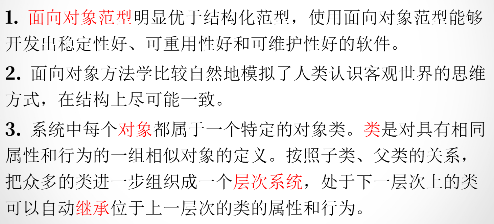

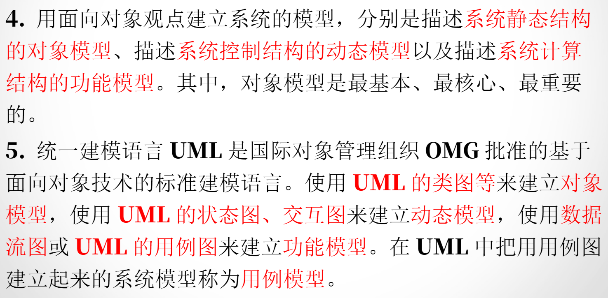

### 面向对象建模

用面向对象方法开发软件，通常需要建立3种形式的模型，它们分别是：

1. 描述系统数据结构的对象模型（最重要、最基本、最核心的）
2. 描述系统控制结构的动态模型
3. 描述系统功能的功能模型

## 十：面向对象分析

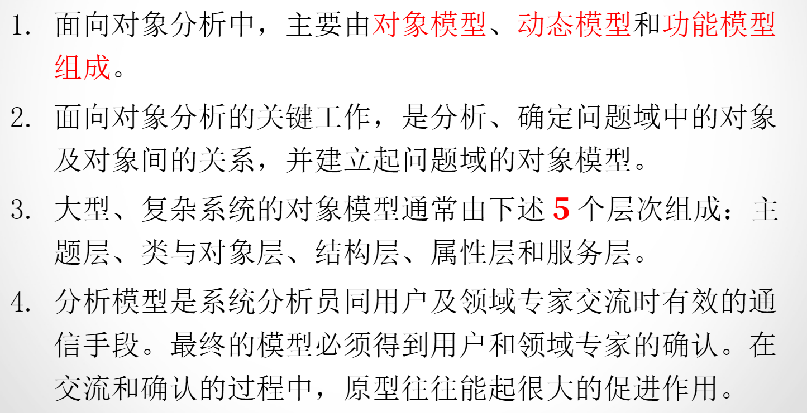

### 3个模型

在面向对象分析中，主要由**对象模型**、**动态模型**和**功能模型**组成。对象模型是最基本、最重要、最核心的。

### **对象模型**通常由下述5个层次组成

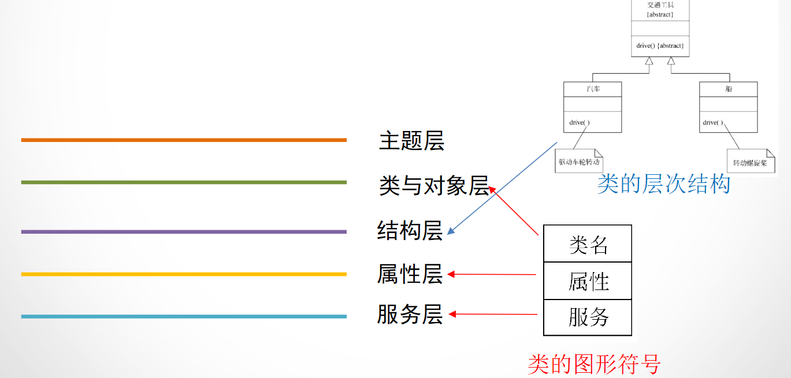

**主题层（Subject Layer）**

- 系统最高层的划分
- 把整个系统按“业务主题”拆成多个部分
- 例如：用户管理、订单管理、支付系统

**类与对象层（Class & Object Layer）**

- 描述系统中的核心类和对象
- 包括属性、方法、对象之间关系
- 面向对象分析设计的核心层

**结构层（Structure Layer）**

- 描述对象之间如何组织
- 如继承、聚合、组合、关联等结构关系

**属性层（Attribute Layer）**

- 描述对象内部的数据特征
- 即对象包含哪些属性、字段、状态

**服务层（Service Layer）**

- 描述对象提供的操作和行为
- 即方法、接口、消息通信等

## 十一：面向对象设计

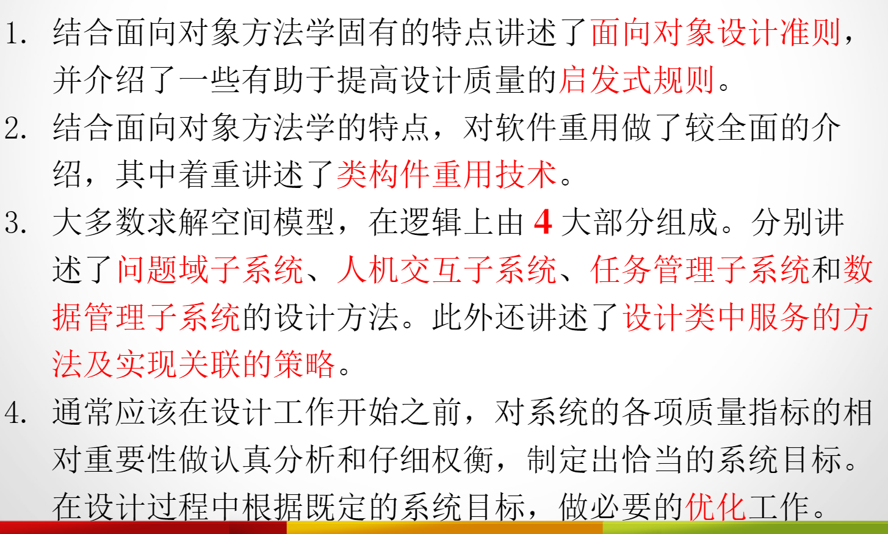

### 面向对象设计准则

1. 模块化
2. 抽象：数据抽象，过程抽象，参数抽象（模板元编程）
3. 信息隐藏
4. 弱耦合
5. 强内聚
6. 可重用

### 启发式规则

1. 设计结果应该清晰易懂
2. 一般-特殊结构的深度应适当
3. 设计简单的类
4. 使用简单的协议
5. 使用简单的服务
6. 把设计变动减至最小

### 类构件重用技术

同一事物不作修改或稍加改动就多次重复使用。

1. 实例重用：使用适当的构造函数，按照需要创建类的实例
2. 继承重用：继承性提供了一种对已有的类构件进行裁剪的机制
3. 多态重用：一般性，抽象性

### 系统分解

面向对象设计模型的4大组成部分

1. 问题域
2. 人机交互
3. 任务管理
4. 数据管理

### 设计类中的服务的方法

1. 设计实现服务的算法
2. 选择数据结构
3. 算法与数据结构的关系
4. 定义内部类和内部操作

### 实现关联的策略

1. 单向关联：一方知道另一方
2. 双向关联：两方互相知道

### 优化

1. 确定优先级
2. 提高效率的几项技术（增加冗余关联，调整查询次序，保留派生属性）
3. 调整继承关系（抽象与具体，委托，为提高继承程度而修改类定义）

## 十二：面向对象实现

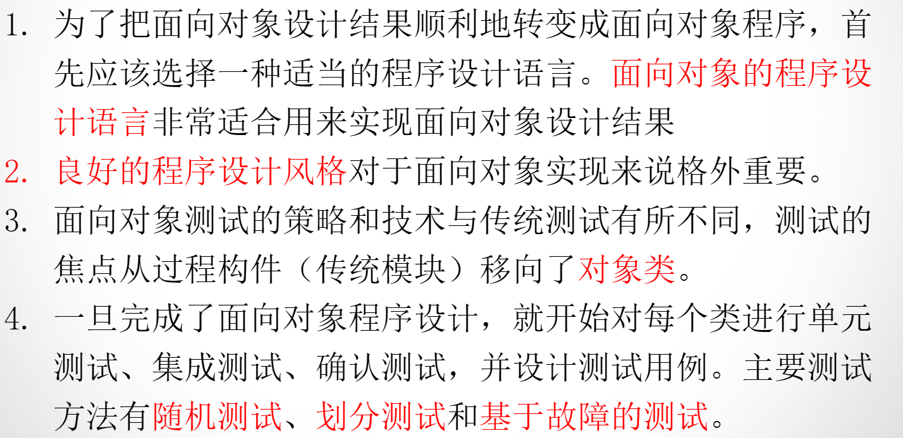

### 程序设计风格

1. 提高可重用性
2. 提高可扩展性
3. 提高健壮性

### 测试类的方法

1. 随机测试
2. 划分测试
   1. 基于状态的划分
   2. 基于属性的划分
   3. 基于功能的划分
3. 基于故障的测试

### 十三：软件项目管理

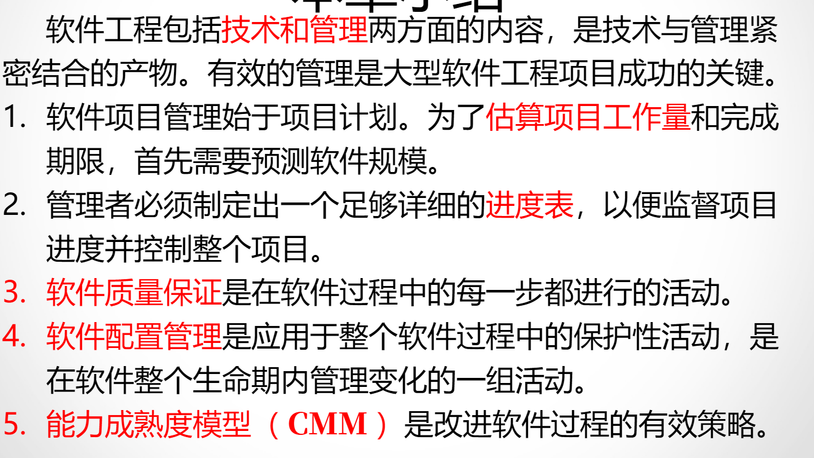

### 软件质量保证

1. 基于非执行的测试（也称为复审或评审）
2. 基于执行的测试（软件测试）
3. 程序正确性证明

包括：

1. 技术复审的必要性
2. 走查
3. 审查
4. 程序

### 软件配置管理

### 软件配置管理过程

1. 标识软件配置中的对象
2. 版本控制
3. 变化控制
4. 配置审计
5. 状态报告

### 能力成熟度模型

用于评价软件机构的软件过程能力成熟度的模型。

1. 初始级：无序，混乱，不稳定，无法预测，项目能否成功完全取决于开发人员的个人能力
2. 可重复级：基本的项目管理过程，可以跟踪成本、进度、功能和质量
3. 已定义级：已经定义了完整的软件过程（过程模型），软件过程已经文档化和标准化
4. 已管理级：软件过程（过程模型和过程实例）和软件产品都建立了定量的质量目标，所有项目的重要过程活动都是可度量的
5. 优化级：以防止出现缺陷为目标的机构，它有能力识别软件过程要素的薄弱环节，并有足够的手段改进它们。软件过程是可优化的
