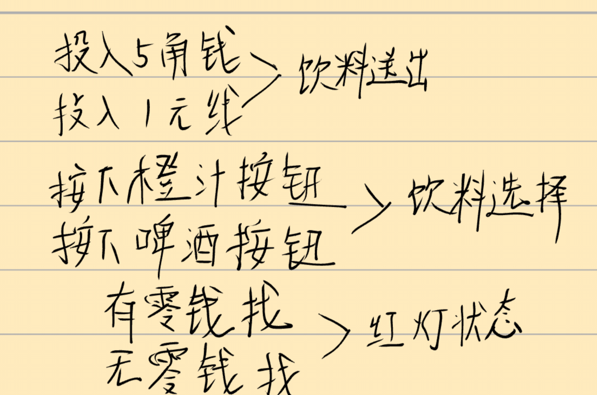
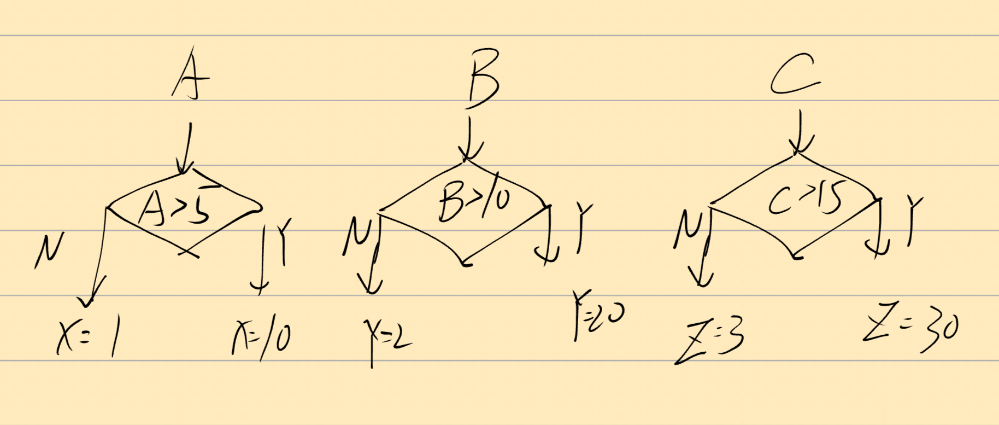
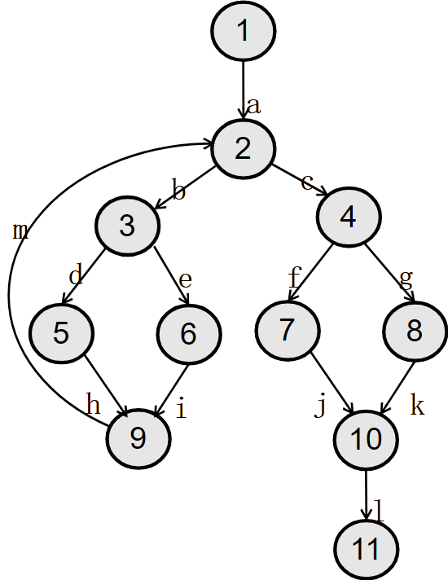

## 3-2

有一个处理单价为 5 角钱的饮料的自动售货机软件测试用例的设计。其规格说明如下：若投入 5 角钱或 1 元钱的硬币，押下“橙汁”或“啤酒”的按钮，则相应的饮料就送出来，若售货机没有零钱找，则一个显示“零钱找完”的红灯亮，这时在投入 1 元硬币并押下按钮后，饮料不送出来而且 1 元硬币也退出来；若有零钱找，则显示“零钱找完”的红灯灭，在送出饮料的同时退还 5 角硬币。
（1）分析这一段说明，列出原因和结果。
（2）画出因果图。
（3）列出判定表。
（4）写出全部的测试用例。

(1)

原因：

- 投入 5 角钱

- 投入 1 元钱

- 按下"橙汁"按钮

- 按下"啤酒"按钮

- 售货机有零钱找

- 售货机无零钱找

  

结果：

- 相应饮料送出

- 显示"零钱找完"红灯亮

- 显示"零钱找完"红灯灭

- 1 元硬币退出

- 退还 5 角硬币

(2)因果图：



（3）判定表：

| 规则1    | 规则2    | 规则3    | 规则4    | 规则5   | 规则6   |
| -------- | -------- | -------- | -------- | ------- | ------- |
| 投入5角  | 投入5角  | 投入1元  | 投入1元  | 投入1元 | 投入1元 |
| 橙汁     | 啤酒     | 橙汁     | 啤酒     | 橙汁    | 啤酒    |
| 有零钱   | 有零钱   | 有零钱   | 有零钱   | 无零钱  | 无零钱  |
| 饮料送出 | 饮料送出 | 饮料送出 | 饮料送出 | 不送出  | 不送出  |
| 退5角    | 退5角    | 退5角    | 退5角    | 退1元   | 退1元   |
| 红灯灭   | 红灯灭   | 红灯灭   | 红灯灭   | 红灯亮  | 红灯亮  |

(4)测试用例

| 测试用例编号 | 输入条件                | 预期输出                  |
| ------------ | ----------------------- | ------------------------- |
| TC001        | 投入5角，按橙汁         | 橙汁送出                  |
| TC002        | 投入5角，按啤酒         | 啤酒送出                  |
| TC003        | 投入1元，按橙汁，有零钱 | 橙汁送出，退5角           |
| TC004        | 投入1元，按啤酒，有零钱 | 啤酒送出，退5角           |
| TC005        | 投入1元，按橙汁，无零钱 | 红灯亮，饮料不送出，退1元 |
| TC006        | 投入1元，按啤酒，无零钱 | 红灯亮，饮料不送出，退1元 |


## 3-4

针对三角形问题，假设 a,b,c 3 个边的边界都是 1~200,应用健壮性测试的方法，基于单缺陷假设，设计边界值测试数据，同时给出每一组数据的预期结果。


| 测试用例 | a    | b    | c    | 预期结果   | 说明            |
| -------- | ---- | ---- | ---- | ---------- | --------------- |
| BV01     | 1    | 100  | 100  | 等腰三角形 | a最小有效值     |
| BV02     | 2    | 100  | 100  | 等腰三角形 | a略大于最小值   |
| BV03     | 100  | 100  | 100  | 等边三角形 | a正常值         |
| BV04     | 199  | 100  | 100  | 等腰三角形 | a略小于最大值   |
| BV05     | 200  | 100  | 100  | 等腰三角形 | a最大有效值     |
| BV06     | 0    | 100  | 100  | 非三角形   | a无效值(下界外) |
| BV07     | 201  | 100  | 100  | 非三角形   | a无效值(上界外) |
| BV08     | 100  | 1    | 100  | 等腰三角形 | b最小有效值     |
| BV09     | 100  | 2    | 100  | 等腰三角形 | b略大于最小值   |
| BV10     | 100  | 100  | 100  | 等边三角形 | b正常值         |
| BV11     | 100  | 199  | 100  | 等腰三角形 | b略小于最大值   |
| BV12     | 100  | 200  | 100  | 等腰三角形 | b最大有效值     |
| BV13     | 100  | 0    | 100  | 非三角形   | b无效值(下界外) |
| BV14     | 100  | 201  | 100  | 非三角形   | b无效值(上界外) |
| BV15     | 100  | 100  | 1    | 等腰三角形 | c最小有效值     |
| BV16     | 100  | 100  | 2    | 等腰三角形 | c略大于最小值   |
| BV17     | 100  | 100  | 100  | 等边三角形 | c正常值         |
| BV18     | 100  | 100  | 199  | 等腰三角形 | c略小于最大值   |
| BV19     | 100  | 100  | 200  | 等腰三角形 | c最大有效值     |
| BV20     | 100  | 100  | 0    | 非三角形   | c无效值(下界外) |
| BV21     | 100  | 100  | 201  | 非三角形   | c无效值(上界外) |

## 4-3

画出下列伪码程序的程序框图，设计语句覆盖和路径覆盖的测试用例。

```assembly
START
INPUT(A,B,C)
IF A>5
   THEN X=10
   ELSE X=1
ENDIF
IF B>10
   THEN Y=20
   ELSE Y=2
ENDIF
IF C>15
   THEN Z=30
   ELSE Z=3
ENDF
PRINT(X,Y,Z)
STOP
```



- TC01: A=6, B=11, C=16 → 预期输出(10,20,30)
- TC02: A=4, B=9, C=14 → 预期输出(1,2,3)


- TC01: A=6, B=11, C=16 → 预期输出(10,20,30) #路径：A>5, B>10, C>15
- TC02: A=6, B=11, C=10 → 预期输出(10,20,3)  #路径：A>5, B>10, C≤15
- TC03: A=6, B=5, C=16  → 预期输出(10,2,30)  #路径：A>5, B≤10, C>15
- TC04: A=6, B=5, C=10  → 预期输出(10,2,3)   #路径：A>5, B≤10, C≤15
- TC05: A=3, B=11, C=16 → 预期输出(1,20,30)  #路径：A≤5, B>10, C>15
- TC06: A=3, B=11, C=10 → 预期输出(1,20,3)   #路径：A≤5, B>10, C≤15
- TC07: A=3, B=5, C=16  → 预期输出(1,2,30)   #路径：A≤5, B≤10, C>15
- TC08: A=3, B=5, C=10  → 预期输出(1,2,3)    #路径：A≤5, B≤10, C≤15

## 4-4

针对下面控制流图，写出路径表达式（不循环、循环一次）；再根据路径表达式计算路径数（不循环、循环一次）。



图像描述：

| 起点 | 经由路径 | 终点 |
| ---- | -------- | ---- |
| 1    | a        | 2    |
| 2    | b        | 3    |
| 2    | c        | 4    |
| 3    | d        | 5    |
| 3    | e        | 6    |
| 4    | f        | 7    |
| 4    | g        | 8    |
| 5    | h        | 9    |
| 6    | i        | 9    |
| 7    | j        | 10   |
| 8    | k        | 10   |
| 10   | l        | 11   |
| 9    | m        | 2    |


路径表达式（不循环）：

- P1: a-b-d-h-m (1→2→3→5→9→2) - 但这是循环路径
- 实际不循环路径：a-b-d (1→2→3→5), a-b-e (1→2→3→6), a-c-f (1→2→4→7), a-c-g (1→2→4→8), a-b-d-h (1→2→3→5→9), a-b-e-i (1→2→3→6→9), a-c-f-j (1→2→4→7→10), a-c-g-k (1→2→4→8→10), a-c-f-j-l (1→2→4→7→10→11), a-c-g-k-l (1→2→4→8→10→11)

路径表达式（循环一次）：

- a-b-d-h-m-b-d (经过节点：1→2→3→5→9→2→3→5)
- a-b-d-h-m-b-e (经过节点：1→2→3→5→9→2→3→6)
- a-b-e-i-m-b-d (经过节点：1→2→3→6→9→2→3→5)
- a-b-e-i-m-b-e (经过节点：1→2→3→6→9→2→3→6)
- a-c-f-j-l (1→2→4→7→10→11)
- a-c-g-k-l (1→2→4→8→10→11)

路径数计算：

- 不循环路径数：从节点1到节点11的所有简单路径
- 循环一次路径数：包含循环的路径数量

## 4-5

下面是快速排序算法中的一趟划分算法，其中 datalist 是数据表，它有两个数据成员：一个是数据类型为 Element 的数组 V，另一个是数组大小 n。算法中用到两个操作，一是取其数组元素 V[i]的关键码操作 getKey()，一是交换两数组元素内容的操作 Swap()。

```c++
int Partition( datalist &list, int low, int high)
{
 int k=low; Element pivot = list.V[low];
 for(int i = low+1;i<=high; i++)
       if(list.V[i].getKey()<pivot.getKey()&& ++k!=i)
              Swap(list.V[k],list.V[i]);

 Swap(list.V[k],list.V[low]);

 return k;
 }
```

试画出程序流程图，并转化成控制流图，使用路径覆盖的方法为它设计足够的测试用例（循环次数限定为 1 次）


控制流图节点：

- 节点1：初始化部分
- 节点2：for循环条件判断
- 节点3：内层if条件判断
- 节点4：交换操作
- 节点5：i自增
- 节点6：k与low比较
- 节点7：交换操作
- 节点8：返回k

路径覆盖测试用例：

- TC01: 数组[3,1,4,2], low=0, high=3 → 预期返回索引2，数组变为[2,1,3,4]
- TC02: 数组[5,4,3,2], low=0, high=3 → 预期返回索引3，数组变为[2,4,3,5] 
- TC03: 数组[1,2,3,4], low=0, high=3 → 预期返回索引0，数组变为[1,2,3,4]
- TC04: 数组[3,3,3,3], low=0, high=3 → 预期返回索引0，数组不变[3,3,3,3]
